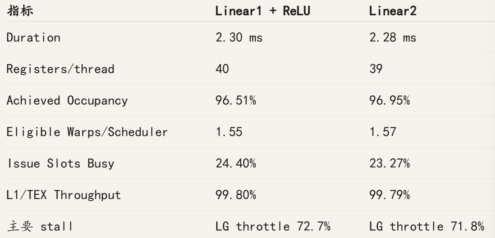
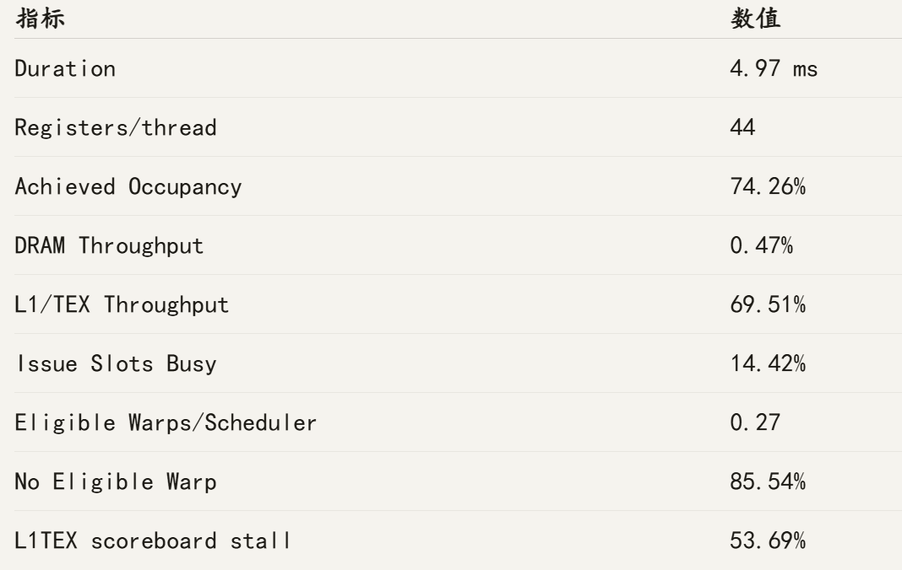

# From Naive CUDA Kernels to Profiling-Guided GPU Optimization

## 基于六类算子的 CUDA GPU Performance Engineering 系统研究

**Repository:** cuda-self-learning
**Audited revision:** 78cd62a（main，2026-09-01）
**Evidence scope:** 当前源码、项目日志、31 张仓库图片、Nsight Systems 原始报告、Git 历史，以及六个 CUDA 程序的重新编译与运行

## Abstract

This report studies how CUDA optimization strategies change—not merely reduce—the dominant bottleneck of representative GPU workloads. Six FP32 operators were implemented and evaluated on an NVIDIA GeForce RTX 3050 Ti Laptop GPU: vector addition, parallel reduction, softmax, matrix multiplication, a two-layer MLP, and scaled dot-product attention. The project follows a common performance-engineering workflow: construct a CPU or higher-precision reference, establish a naive GPU baseline, validate correctness, measure device execution with CUDA Events after warm-up, use arithmetic intensity and data-movement models to form bottleneck hypotheses, and inspect selected kernels with Nsight Systems and Nsight Compute.

The experiments span memory-bandwidth-bound, synchronization-bound, data-reuse-sensitive, and fused AI workloads. In the first default-NVCC audit snapshot, representative results include a 22.91× reduction speedup from removing global atomic contention and reducing hierarchical overhead; a 3.63× softmax speedup from changing one-thread-per-row execution into block-parallel online reduction; and a 3.67× GEMM speedup, reaching 425.95 GFLOPS, through shared-memory tiling plus 2×2 register blocking. Equally important, several plausible optimizations did not improve performance. Warp-tiled GEMM matched ordinary shared tiling because its 8×64 block geometry did not increase block-level reuse. Full MLP fusion removed intermediate hidden-tensor traffic but reduced eligible warps and increased dependency and synchronization costs, making it 6.2% slower than the naive pipeline. A FlashAttention-inspired tiled/fused attention prototype eliminated global score/probability materialization, yet remained slower because a single lane serialized score-tile computation, average useful lane activity fell to 4.55/32, occupancy reached only 19.31%, and CTA-barrier stalls dominated.

Across these cases, the central result is that optimization is a resource trade-off across the complete GPU execution hierarchy. Reducing off-chip traffic is beneficial only when work partitioning, lane utilization, synchronization, register/shared-memory pressure, and latency hiding remain favorable. The project therefore demonstrates a transition from writing CUDA kernels to forming and testing quantitative hypotheses about GPU performance.

> **Evidence convention.** “First audit snapshot” denotes the initial CUDA 13.3 rebuild/rerun on 2026-09-01；“second terminal pass” denotes the final same-binary sensitivity rerun（MatMul additionally rebuilt at current HEAD）；“archived measurement” denotes 项目日志.md、仓库截图或已保存的 Nsight Systems 报告。Nsight Compute 指标已与截图和日志逐项核对，但本次审计没有重新采集。文中的数据流量与 arithmetic intensity 若标为 analytical estimate，则不是实测硬件 counter。

## Selected Quantitative Results

| Workload | First Audit Snapshot / Representative Result | Interpretation |
| --- | ---: | --- |
| Vector Add | 四个版本 1.224–1.239 ms；Naive ≈ 164.4 GB/s（stored Nsight Systems run） | 四个版本都必须移动约 12 bytes/element；增加代码结构没有减少主导流量。 |
| Reduction | 2.256 ms Atomic → 0.0985 ms Chunked，**22.91×**（first audit snapshot） | 消除全局原子争用，并减少 partial sums 与 block reduction；被 profile 的 Chunked 第一阶段达到 87.63% DRAM throughput。 |
| Softmax | 4.585 ms Naive → 1.264 ms Block-online，**3.63×**（first audit snapshot） | 行内 block 并行和联合 (max,sum) reduction 消除访存延迟与遍历开销；barrier 成为新瓶颈。 |
| MatMul | 18.482 ms / 116.19 GFLOPS Naive → 5.042 ms / **425.95 GFLOPS**，**3.67×** | Shared-memory 与 register reuse 减少重复 load；瓶颈移向 LSU/MIO 与片上访存组织。 |
| MLP | 4.654 ms Naive；4.596 ms Fused；4.943 ms Tiled-fused（first audit snapshot） | 轻量 fusion 仅快 1.2%；完全 fusion 因资源和调度成本比 Naive 慢 6.2%。 |
| Attention | 日志 0.734 vs. 0.922 ms；first audit 2.844 vs. 3.936 ms；second pass 0.724 vs. 0.922 ms | 绝对时间跨运行不稳定，但所有保留结果都显示 Tiled 慢于 Naive。 |

## Project Overview

| Module | Baseline | Optimization Path | Main Concept | First Audit Snapshot Result |
| --- | --- | --- | --- | ---: |
| Vector Add | One thread/element | Grid-stride → 4 items/thread → float4 | Coalescing、vector width、bandwidth ceiling | float4：1.117 ms、180.2 GB/s；仅 3 trials，1.03× |
| Reduction | Global atomicAdd | Shared tree → warp shuffle → chunked | Contention 与 hierarchical reduction | Chunked：0.0985 ms，22.91× |
| Softmax | One thread/row | Online → block → block-online | Traversal count、coalescing、reduction | Block-online：1.264 ms，3.63× |
| MatMul | One thread/output | Shared tile → warp tile → register tile | Block/thread-level data reuse | Register-blocked：5.042 ms，425.95 GFLOPS，3.67× |
| MLP | Linear → ReLU → Linear | Epilogue fusion → single-kernel tiled fusion | Fusion vs. resources/latency hiding | Two-kernel Fused：4.596 ms，116.80 GFLOPS，1.012× |
| Attention | QKᵀ → Softmax → PV | Bc=32 tiled/fused online update | IO-aware attention 与 work partitioning | Naive 仍最快；各轮 Tiled/Naive 性能比 0.72–0.83 |

# 1. Introduction

GPU kernel latency 并不只由 FLOP 数决定。同一数学运算可能因 address coalescing、cache reuse、register lifetime、shared-memory transaction、active-lane fraction、block residency、eligible-warps supply、barrier frequency 和 instruction-pipeline pressure 的不同而表现出完全不同的限制。一个 transformation 即使减少了 global-memory bytes，只要同时串行化了工作或减少了隐藏延迟所需的 warps，仍可能变慢。

本项目的核心问题是：

> **How do different CUDA optimization strategies change the performance bottleneck of representative GPU workloads?**

工作负载的选择形成了一条有意设计的复杂度路径。Vector Addition 提供近似纯 bandwidth case；Reduction 引入跨线程通信与同步；Softmax 同时包含 reduction、special function、数值稳定性和 row mapping；GEMM 将 data reuse 与 arithmetic intensity 置于中心；MLP 检验跨 dense layer 的 operator fusion；Attention 则组合 dot product、softmax、mask、中间张量流量和 IO-aware fusion。它们共同覆盖从单一资源上限到 thread、warp、block、SM 与 memory hierarchy 耦合权衡的演进。

因此，本项目的主要产出不是若干 CUDA API 示例，而是统一实验闭环：

**Measure → Diagnose → Optimize → Re-measure**

每次修改都先说明理论上减少了什么，再用相同计时边界比较；若结果与预期不符，则通过 profiler 判断瓶颈是否移动。正结果与负结果采用同样的证据标准。

# 2. Experimental Platform

## 2.1 Hardware and software

| Item | Verified Configuration | Evidence Status |
| --- | --- | --- |
| GPU | NVIDIA GeForce RTX 3050 Ti Laptop GPU | 当前 nvidia-smi；仓库 profiler captures |
| Compute capability | 8.6 | 当前 nvidia-smi；Nsight kernel headers |
| SM count | 20 | Nsight Compute Launch Statistics |
| Driver | 610.74 | 当前 nvidia-smi |
| CUDA compiler | CUDA 13.3，NVCC 13.3.73 | 本次 audit rebuild |
| Host environment | Ubuntu on WSL2，Linux 6.6.87.2-microsoft-standard-WSL2 | 当前环境 |
| Host compiler | GCC/G++ 13.3.0 | 当前环境；.vscode 配置 GNU++17 |
| Precision | GPU kernels 为 FP32；部分 CPU reference 用 double 累加 | 源码审计 |
| Profilers | Nsight Systems、Nsight Compute | .nsys-rep、截图、项目日志 |

保存的 Nsight Systems 报告由 WSL CLI 2026.1.3 解析，timeline 截图则来自 Windows GUI 2026.4.1。Nsight Compute executable 的精确版本没有可靠保存在 tracked repository 中，当前 WSL PATH 也没有 ncu，因此本报告不猜测其版本。

仓库没有 Makefile/CMake，也没有记录显式 compiler optimization flags。MatMul 截图中的命令是普通 nvcc 编译；本次复核同样使用 NVCC 默认设置，并将二进制写入 /tmp，没有覆盖仓库内已有二进制。

## 2.2 Benchmark protocol and timing boundary

较成熟的 benchmark 都在计时前完成 device allocation 与已初始化输入的 H2D copy。Warm-up 后执行 device synchronization；每个 trial 在 launch function 前后记录 CUDA Event，并用 cudaEventSynchronize(stop) 与 cudaEventElapsedTime 取得 device elapsed time。D2H、allocation 和 correctness run 不进入 performance interval。

| Module | Benchmark Shape | Warm-ups | Trials | Timed Unit |
| --- | ---: | ---: | ---: | --- |
| Vector Add | N = 16,777,216 | 1 | 3 | 一个 kernel；仅有 tail 时附加 tail kernel |
| Reduction | N = 1,048,613 | 5 | 20 | Atomic 单次 launch 或完整 multi-stage reduction |
| Softmax | 16,384 × 257 | 20 | 200 | 一个 kernel |
| MatMul | M=N=K=1024 | 20 | 200 | 一个 kernel |
| MLP | 4096×128 → 4096×256 → 4096×128 | 20 | 200 | 按版本包含三、二或一个 kernel |
| Attention | N=512，d=64 | 20 | 200 | Naive 三 kernel pipeline 或 Tiled 单 kernel |

为检验绝对时间稳定性，第二轮终检复跑了同一批已编译二进制；MatMul 还在当前 HEAD 上以相同 NVCC 默认设置重新编译。各行的版本次序写在 Module 列中：

| Module（version order） | First audit snapshot (ms) | Second terminal pass (ms) | Ordering check |
| --- | --- | --- | --- |
| Vector（Naive/Grid/Tiled/float4） | 1.15063 / 1.48445 / 1.14917 / 1.11717 | 1.20490 / 1.20174 / 1.22675 / 1.21099 | 四者接近；minor ordering 改变 |
| Reduction（Atomic/Shared/Warp/Chunked） | 2.25624 / 0.29356 / 0.127118 / 0.0984992 | 2.26162 / 0.0816304 / 0.0437728 / 0.0384000 | 优化排序一致，幅度变化 |
| Softmax（Naive/Online/Block/Block-online） | 4.58537 / 4.40362 / 2.24617 / 1.26420 | 4.27215 / 4.16868 / 0.637510 / 0.409828 | 排序一致，幅度变化 |
| MatMul（Naive/Shared/Warp/Register） | 18.4823 / 13.9117 / 13.9447 / 5.04163 | 6.12178 / 4.29685 / 4.69647 / 1.72491 | Register 最快；Shared/Warp 接近 |
| MLP（Naive/Fused/Tiled-fused） | 4.65369 / 4.59634 / 4.94312 | 1.42835 / 1.40831 / 1.53790 | 排序一致 |
| Attention（Naive/Tiled） | 2.84417 / 3.93592 | 0.724436 / 0.921642 | Tiled 仍慢 |

两轮数据不能直接平均：仓库未锁频，也没有 per-trial in-kernel clock、power 或 temperature trace；运行前的 nvidia-smi 快照不能替代这些记录。后续各节保留首轮 snapshot，以便与已有 profiler/log context 对齐；第二轮作为 sensitivity check。除 Vector 的近似并列次序外，主要版本排序保持不变，但绝对 latency 与 speedup magnitude 不应被视为可复现常数。

MLP 与 Attention 的 event interval 有意包围整个 launch group，因此 launch count 与 intermediate device traffic 都进入比较。Reduction Atomic 的 cudaMemset 在 start event 之前提交到同一 default stream，清零不计入 latency。

CUDA Event 只能回答“多长时间”，不能独立回答“为什么”。Nsight Systems 用来验证 launch/memory timeline 与 API boundary；Nsight Compute 再区分 off-chip throughput、L1/TEX/LSU 活动、occupancy、scheduler eligibility、lane utilization 和 warp stalls。

## 2.3 Correctness scope

| Module | Current Automated Check | Boundary Not Fully Covered |
| --- | --- | --- |
| Vector Add | 四个 GPU 版本对 CPU，N=2²⁴ | float4 tail path 存在，但当前 N 可被 4 整除，没有实际覆盖 tail。 |
| Reduction | 四版本对 double CPU sum，N=2²⁰+37 | 覆盖 irregular tail；输入为小整数模式。 |
| Softmax | 六版本；64×257、masked 64×257、causal 64×64 | 没有 extreme-value 与多 shape sweep。 |
| MatMul | 当前 main 测四版本 64³ | 日志记录 67×70×19 曾通过，但当前自动测试未保留。 |
| MLP | 三版本、一个固定网络 shape | 单一确定性输入分布和 absolute tolerance。 |
| Attention | Naive/Tiled 的 non-causal 与 causal，512×64 | 单一 sequence/head shape；causal 未单独 benchmark。 |

本次审计重新编译了六个文件，所有当前打印的 correctness check 均通过。不过，03_softmax.cu 至 06_attention.cu 在检查失败时通常只打印 failed，并不返回非零进程状态；因此仅凭 exit code 0 不能构成可靠 test oracle。

# 3. Performance Engineering Methodology

## 3.1 Reference implementation

每个模块都提供 CPU implementation 或 reference path。Softmax 与 Attention 使用 max subtraction 保证稳定性，CPU sum/accumulator 部分或全部使用 double。GPU 目标仍为 FP32，因此 reference 降低了“用同一低精度错误相互验证”的风险，但没有代替更完整的 numerical error study。

## 3.2 Naive CUDA baseline

Baseline 尽量保持数学分解，采用直接 mapping：one thread/element、one thread/row、one thread/output，或由 global intermediate 连接的多个 kernel。它同时承担功能基线与分析基线的角色，使 redundant loads、contention、insufficient parallelism 和 materialization cost 在优化前可见。

## 3.3 Correctness before performance

源码覆盖 normal shape、部分 irregular tail、mask 和 causal diagonal。Causal 条件正确保留对角线（col <= row），被 mask 的 score 设为大负值。尚未覆盖的 Vector tail 与当前 MatMul irregular case 被明确列为限制，而不是从代码外观推定已验证。

## 3.4 Quantitative metrics and analytical modeling

不同 workload 使用不同指标：latency 适用于全部模块；Vector Add 使用 effective bandwidth 与 GFLOPS；Reduction 使用 element throughput、input bandwidth 与 speedup；Softmax 使用 element throughput；GEMM、MLP 和 Attention 的两个主要 matrix products 使用 effective GFLOPS。

Arithmetic intensity 定义为：

$$
AI=\frac{\text{FLOPs}}{\text{Bytes}}.
$$

低 AI 提示 bandwidth ceiling，但不能证明观察到的 kernel 已打满 DRAM。Kernel 也可能是 memory-latency-bound、cache/LSU queue-bound，或因 eligible warps 不足而无法发射。本文借用 Roofline 作为解释框架，但仓库没有 sustained-peak calibration 和完整 byte counters，因此不声称完成了正式 Roofline experiment。

## 3.5 Profiling-guided loop

统一流程为：

1. 在匹配的 event boundary 下测量 latency/throughput。
2. 从 FLOPs、mandatory traffic、mapping 与 resource use 建立假设。
3. 用 Nsight Systems 检查 launches 与 transfers。
4. 用 Nsight Compute 检查 throughput、residency、eligible warps、stalls 与 memory hierarchy。
5. 只改变一个主要结构属性：traffic、reduction、tiling、register reuse、fusion 或 work partitioning。
6. 重测并判断 bottleneck 是消失还是转移。

“使用 shared memory”或“完成 fusion”只是机制，不是性能改进的证据。

# 4. Vector Addition

## 4.1 Implementations and mapping

01_vector_add.cu 包含 CPU reference 与四个 GPU 版本：

- **Naive：**一个 thread 计算一个 c[i]。
- **Grid-stride：**thread 按 grid stride 遍历；当前 grid 已足够大，通常每 thread 仍只执行一次。
- **Tiled/multi-item：**256 threads 覆盖 1,024 elements；每 thread 处理四个相隔 256 的位置，每轮访问仍 coalesced。
- **Vectorized：**每 thread 处理一个 float4；不足四个元素的尾部回退到 scalar kernel。

每个元素需要两次 float load、一次 float store 与一次加法：

$$
\text{Bytes}=4+4+4=12,\qquad \text{FLOPs}=1,
$$

$$
AI\approx \frac{1}{12}=0.083\ \text{FLOP/byte}.
$$

N=16,777,216 时，compulsory traffic 为 201,326,592 bytes（201.33 MB，或 192 MiB）。四个版本都没有减少这两次 load 与一次 store。

## 4.2 Results

| Kernel | First Audit Latency | Effective Bandwidth | Effective GFLOPS | Relative Performance |
| --- | ---: | ---: | ---: | ---: |
| Naive | 1.1506 ms | 175.0 GB/s | 14.58 | 1.000× |
| Grid-stride | 1.4845 ms | 135.6 GB/s | 11.30 | 0.775× |
| Tiled, 4 items/thread | 1.1492 ms | 175.2 GB/s | 14.60 | 1.001× |
| float4 | 1.1172 ms | 180.2 GB/s | 15.02 | 1.030× |

这些 audit 数值只有一次 warm-up 和三次 trials；3% 的 float4 优势不足以支持普遍结论。保存的 Nsight Systems 报告提供了五次 profiled instances：四个平均值均在 1.224–1.239 ms，Naive 对应约 164.4 GB/s。后者更有力地支持“版本接近”，而不是支持某个 winner。

**Figure 1. Nsight Systems summary for the four Vector Add kernels.** 四个 device time 接近，与 compulsory traffic 不变一致；图中的 H2D/D2H 属于 setup/correctness，不在 CUDA Event kernel timing 内。

### Lesson learned

Baseline 已具有 coalesced access。Grid-stride control flow、multi-item loop 与更宽 source type 不会自动创造 reuse。看起来更复杂的 kernel 可以停留在同一 bandwidth ceiling，甚至因 loop/index overhead 退化。下一步应增加 trials，扫描 alignment/tail，采集实际 DRAM bytes，并加入 device-to-device copy bandwidth reference。

# 5. Parallel Reduction

## 5.1 Optimization evolution

四个版本分别隔离不同 overhead：

1. **Atomic：**所有 thread 更新同一 global address，形成 contention 与 serialization。
2. **Shared tree：**每个 block 在 shared memory 内 reduction 并写一个 partial sum；host 继续 launch，直至只剩一个值。
3. **Warp shuffle：**warp 内通过 shuffle 交换 register value，只把 warp totals 写入 shared memory，再由第一个 warp 完成 block reduction。
4. **Chunked：**每 thread 先在 register 中累加四个输入，再执行 block shared tree；第一阶段 partial sums 从 4,097 降到 1,025。

Warp primitive 的关键代码是：

~~~cuda
__device__ float warp_reduce_sum(float value) {
    for (int offset = 16; offset > 0; offset /= 2) {
        value += __shfl_down_sync(0xffffffff, value, offset);
    }
    return value;
}
~~~

它减少 intra-warp shared traffic 与 barrier，而不改变输入数量或数学加法数量。Chunking 同样减少 hierarchy overhead，但会增加 per-thread work 与 register lifetime。

## 5.2 Results and model

约 N 次加法读取 4N bytes：

$$
AI\approx \frac{N}{4N}=0.25\ \text{FLOP/byte}.
$$

| Version | First Audit Latency | Element Throughput | Effective Input Bandwidth | Speedup vs. Atomic |
| --- | ---: | ---: | ---: | ---: |
| Atomic | 2.2562 ms | 0.465 GElem/s | 1.86 GB/s | 1.00× |
| Shared | 0.2936 ms | 3.572 GElem/s | 14.29 GB/s | 7.69× |
| Warp | 0.1271 ms | 8.249 GElem/s | 33.00 GB/s | 17.75× |
| Chunked | 0.0985 ms | 10.646 GElem/s | 42.58 GB/s | 22.91× |

Shared 消除了 global atomic contention，却引入八轮 shared load/store、block-wide barrier 与逐轮增加的 inactive threads。Warp shuffle 移除大部分成本。Chunked 再减少 block 数、partial sums 和后续协作。四 items/thread 在当前 shape 有利，但没有 sweep 证明四是最优；更大 chunk 可能提高 register pressure 并减少 parallelism。

**Figure 2. Nsight Compute profile of the selected first-stage Chunked launch.** Duration 为 31.94 µs，DRAM throughput 87.63%，compute throughput 61.56%。它是 multi-stage algorithm 中被筛选的一次 launch，不是 0.0985 ms 的端到端时间。

同一已追踪 profile 报告 91.29% achieved occupancy；截图没有保留可独立复核的 register count，因此本文不把该项作为定量结论。消除 contention 与大部分 hierarchy cost 后，第一阶段已接近 DRAM-bandwidth regime；完整 latency 仍包含后续 reduction 与 launches。下一步合理版本应把 chunked input accumulation 与 warp-shuffle block reduction 合并，并扫描 items/thread。

# 6. Softmax

## 6.1 Stable and online formulations

Stable Softmax 为：

$$
m=\max_i x_i,\qquad
y_i=\frac{e^{x_i-m}}{\sum_j e^{x_j-m}}.
$$

Online 实现维护状态 (m,l)：

$$
l=\sum_i e^{x_i-m}.
$$

两个 partial states 的正确合并为：

$$
m=\max(m_1,m_2),\qquad
l=l_1e^{m_1-m}+l_2e^{m_2-m}.
$$

Block-online kernel 显式实现 rescaling：

~~~cuda
const float new_max = fmaxf(left_max, right_max);
const float new_sum =
    left_sum  * expf(left_max  - new_max) +
    right_sum * expf(right_max - new_max);
shared_max[tid] = new_max;
shared_sum[tid] = new_sum;
~~~

文件实现 Naive、Online、Masked、Causal、Block 与 Block-online。主要 benchmark 只比较语义相同的四个 unmasked 版本；Masked/Causal 作为 correctness experiments，没有与普通 Softmax 强行做不等工作量的 throughput 对比。

## 6.2 Benchmark

| Version | First Audit Latency | Element Throughput | Speedup vs. Naive |
| --- | ---: | ---: | ---: |
| Naive | 4.5854 ms | 0.9183 GElem/s | 1.00× |
| Online | 4.4036 ms | 0.9562 GElem/s | 1.04× |
| Block | 2.2462 ms | 1.8746 GElem/s | 2.04× |
| Block-online | 1.2642 ms | 3.3307 GElem/s | 3.63× |

Naive 逻辑上扫描 row 三次：max、exponential sum、normalize；Online 将前两者合成一次 state pass，再做 normalize。它只快约 4%，因为少一次 traversal 的收益换来了更多 exp 和 loop-carried dependency。算法层面的 pass reduction 并不保证成比例硬件加速。

更大的收益来自 one block/row mapping：同一 warp 访问相邻列，row-level parallelism 和 coalescing 改善。Block-online 还把两轮独立 reduction 合成一轮 joint state tree。

## 6.3 Bottleneck transition

**Figure 3. Nsight Compute evidence for Naive Softmax.** Benchmark launch 为 64 blocks × 256 threads。No Eligible 为 95.63%，Issue Slots Busy 3.89%；每两条 issued instructions 间约 142 cycles，其中约 121 cycles（84.99%）来自 L1TEX scoreboard dependency。Warp lanes 虽然活跃，但相邻 lanes 在同一 col 访问相隔 257 floats 的不合并地址，且 64 blocks 无法充分隐藏 latency。

**Figure 4. Nsight Compute evidence for Block-online Softmax.** Achieved occupancy 为 90.20%，Issue Slots Busy 76.33%，76.60% 周期至少有一个 eligible warp；DRAM throughput 仅 13.92%。项目日志将 CTA barrier 识别为最大剩余瓶颈；已追踪截图没有保留可独立复核的完整 barrier-stall 数值，因此本文不报告该百分比。

这个实验体现了 bottleneck transfer：Naive 是 memory-latency/supply-bound；Block-online 修正 mapping 与 traversal 后，synchronization 变得可见。下一步应使用 warp shuffle 减少 shared tree/barrier，扫描 columns 与 block size，并报告 max absolute/relative error 与 row-sum error。

# 7. Matrix Multiplication

## 7.1 From one output per thread to register tiles

GEMM 定义为：

$$
C=AB,\qquad C_{ij}=\sum_{k}A_{ik}B_{kj},
$$

其主要计算量为：

$$
\text{FLOPs}\approx 2MNK.
$$

Naive 使用 16×16 block，每 thread 计算一个 output。相邻 output threads 反复请求相同 A row element 和可复用的 B values，是否命中 cache 取决于硬件，代码本身没有显式 block reuse。

Shared-tiled 版本把 A/B 的 16×16 tiles cooperative load 到 shared memory，每个 tile 在 block 内复用。Warp-tiled 使用 32×8 threads 覆盖 8×64 outputs，每 lane 计算两列。Register-blocked 使用 16×16 threads 覆盖 32×32 outputs，每 thread 保存 2×2 accumulator；shared tiles 为 A[32×16] 与 B[16×32]。

忽略 C store 时，block tile 的理想 arithmetic intensity 为：

$$
AI_{\text{tile}}
=\frac{2B_MB_NB_K}{4B_K(B_M+B_N)}
=\frac{B_MB_N}{2(B_M+B_N)}.
$$

| Version | Block Output Tile | Analytical AI |
| --- | ---: | ---: |
| Naive（1×1 model） | 1×1 | 0.25 FLOP/byte |
| Shared tiled | 16×16 | 4.00 FLOP/byte |
| Warp-tiled | 8×64 | 3.56 FLOP/byte |
| Register-blocked | 32×32 | 8.00 FLOP/byte |

## 7.2 Benchmark

M=N=K=1024 时：

$$
2MNK=2,147,483,648\ \text{FLOPs}.
$$

| Kernel | First Audit Latency | Effective Throughput | Speedup vs. Naive |
| --- | ---: | ---: | ---: |
| Naive | 18.4823 ms | 116.19 GFLOPS | 1.00× |
| Shared tiled | 13.9117 ms | 154.37 GFLOPS | 1.33× |
| Warp-tiled | 13.9447 ms | 154.00 GFLOPS | 1.33× |
| Register-blocked | 5.0416 ms | 425.95 GFLOPS | 3.67× |

### Why Warp-tiled did not improve

Warp-tiled 让 thread 计算更多 outputs，却没有提高 block-level reuse。其 8×64 geometry 使 B tile 的每个元素只被 8 个 output rows 复用，理论 AI 3.56 还低于方形 16×16 tile 的 4.00。因此：

> **thread-level reuse ≠ block-level data reuse.**

它与 Shared tiled 基本同速不是异常，而是 tile geometry 的直接结果。

### Why Register-blocking worked

Register-blocked 的 inner loop 让两个 A fragments 与两个 B fragments 形成四个 FMA：

~~~cuda
acc[0][0] += a_frag0 * b_frag0;
acc[0][1] += a_frag0 * b_frag1;
acc[1][0] += a_frag1 * b_frag0;
acc[1][1] += a_frag1 * b_frag1;
~~~

同一个 shared load value 在 register 中服务多个 outputs，32×32 block tile 也增加 global reuse。与只改变 thread ownership 的 Warp-tiled 不同，它同时提高 block 与 thread 两层复用。

## 7.3 Profiling and the on-chip bottleneck

**Figure 5. Naive MatMul profile.** Achieved occupancy 为 98.77%，DRAM throughput 7.86%，L1/TEX throughput 98.27%。高 occupancy 没有消除反复 load 与相关 instruction pressure；off-chip DRAM 并非被打满。

**Figure 6. Register-blocked MatMul workload analysis.** Nsight 报告 FMA pipeline utilization 约 23.6%，而 LSU utilization 达 90.2%；MIO throttle 占平均 warp stall cycles 约 40.37%。优化后的限制已进入 on-chip load/store path。

项目日志的 memory analysis 还记录 shared store bank conflict，并指出 global store 每个 32-byte sector 约只有 16 bytes 有效；已追踪材料没有保留可独立复核的 conflict count，因此本文不报告其次数。源码可解释两类现象：cooperative B loading/shared layout 会产生额外 wavefront；2×2 results 以 scalar nested loops 写回，warp 内当前 store 次序不能形成理想相邻连续 store。

因此，Register-blocked 的下一个目标不是继续笼统“减少 DRAM”，而是改善 B tile cooperative loading、shared layout/padding、bank-conflict behavior 与 C output mapping；对齐 float2 store、larger register tile 与 double buffering 值得实验。Tensor Core/WMMA 属于 future work，当前代码没有实现。

# 8. MLP and Kernel Fusion

## 8.1 Three execution plans

固定网络为：

$$
X_{4096\times128}
\rightarrow H_{4096\times256}
\xrightarrow{\mathrm{ReLU}}
Y_{4096\times128}.
$$

- **Naive：**Linear1、独立 ReLU、Linear2，共三个 kernels；hidden 被 write、read/write、read。
- **Fused：**Linear1 epilogue 内执行 ReLU，再由 Linear2 读取 hidden，共两个 kernels。
- **Tiled-fused：**one block/batch，在一个 kernel 内将 x tiles 与完整 hidden 保存到 shared memory，连续完成两层。

主要计算量（忽略 bias/ReLU）为：

$$
2B(IH+HO)=536,870,912\ \text{FLOPs}.
$$

## 8.2 Benchmark and ideal traffic model

| Version | First Audit Latency | Effective Throughput | Speedup vs. Naive |
| --- | ---: | ---: | ---: |
| Naive | 4.6537 ms | 115.36 GFLOPS | 1.000× |
| Fused | 4.5963 ms | 116.80 GFLOPS | 1.012× |
| Tiled-fused | 4.9431 ms | 108.61 GFLOPS | 0.941× |

Fused 只快约 1.2%；Tiled-fused 比 Fused 慢 7.5%，比 Naive 慢 6.2%。

下表是“假设每个必要 tensor 只从 DRAM 访问一次”的算法级下界，不是实际 cache/global load counters：

| Version | Hidden Global Traffic | Ideal Minimum Total DRAM Traffic | Analytical AI |
| --- | ---: | ---: | ---: |
| Naive | 约 16 MiB（4 accesses） | 约 20.25 MiB | 约 25.3 FLOP/byte |
| Fused | 约 8 MiB（2 accesses） | 约 12.25 MiB | 约 41.8 FLOP/byte |
| Tiled-fused | 0 MiB | 约 4.25 MiB | 约 120.5 FLOP/byte |

理论 AI 最高的版本反而最慢，说明权重 access、片上 dependency、barrier 和 scheduling 决定了当前结果。把 x 与 hidden 放入 shared memory 并没有减少占主要 instruction volume 的 w1/w2 loads。

## 8.3 Profile-supported explanation

**Figure 7. Fused versus Tiled-fused MLP.** Fused 两个 kernels 分别约 2.30 与 2.28 ms，合计与 CUDA Event 的 4.596 ms 一致；它们使用 39–40 registers/thread、约 97% occupancy，主要表现为 LG throttle（约 72%）。Tiled-fused 为 44 registers/thread、74.26% achieved occupancy、0.27 eligible warps/scheduler、14.42% Issue Slots Busy、85.54% No Eligible；53.69% stall 归因于 L1TEX scoreboard dependency。

Tiled-fused 每个 input tile 都有 block barrier。第一阶段 256 threads 计算 hidden，第二阶段只有前 128 threads 计算 output，另一半 threads 处于 inactive state。更长 kernel 增加 register lifetime；可驻留/可发射 warps 减少，因而不能隐藏 weight-load latency。

结论不是“fusion 无效”，而是：

> **Kernel fusion is a resource trade-off, not a universally beneficial transformation.**

当前轻量 epilogue fusion 保留了足够 parallelism，因此略有收益；跨两层的完全 fusion 虽节省 hidden global round trip，却没有建立权重 tile reuse，并付出了 register、barrier 与 thread-underutilization 成本。

# 9. Attention and the Path Toward FlashAttention

## 9.1 Mathematical decomposition

标准 scaled dot-product attention 为：

$$
S=\frac{QK^T}{\sqrt d},\qquad
P=\operatorname{softmax}(S),\qquad
O=PV.
$$

当前固定 N=512、d=64、scale=1/8。Causal version 仅允许 key index 不大于 query index。

Naive pipeline 包含：

1. QKᵀ kernel，物化完整 N×N scores；
2. block-parallel online Softmax，就地把 scores 变为 probabilities；
3. PV kernel，产生 N×d output。

Tiled/fused kernel 采用 one block/query row、64 threads/block 与 Bc=32。Q row、32 个 K tokens、32 个 V tokens 被搬到 shared memory；running max、running sum 和 output accumulator 跨 tiles 更新；global memory 中不物化完整 scores/probabilities。

## 9.2 What the tiled kernel actually parallelizes

Tiled kernel 对 V dimension 的 output accumulation 是 64-way parallel，但 score tile 由 thread 0 串行完成：

~~~cuda
if (d == 0) {
    for (int token = 0; token < kTileTokens; token++) {
        float score = 0.0f;
        for (int i = 0; i < kHeadDim; i++) {
            score += q_shared[i] * k_tile[token][i];
        }
        scores[token] = score * kScale;
    }
}
__syncthreads();
~~~

每个 Bc=32 tile 中，一个 lane 执行 32×64 dot-product operations，另外 63 threads 等待。N/Bc=16 个 tiles 又重复这一过程与 block barriers。Query tile 实际为 Br=1，因此 K/V tile 也不能在多个 query rows 之间复用。

## 9.3 Quantitative results and run-to-run inconsistency

忽略 Softmax special-function cost，QK 与 PV 的主要计算量为：

$$
4N^2d=67,108,864\ \text{FLOPs}.
$$

| Evidence Set | Naive | Tiled | Tiled/Naive Performance | Main-FLOP Throughput |
| --- | ---: | ---: | ---: | --- |
| 项目日志 archived table | 0.734201 ms | 0.921953 ms | 0.796× | 91.40 vs. 72.79 GFLOPS |
| image-29 separate run | 0.772908 ms | 0.934487 ms | 0.827× | 86.83 vs. 71.81 GFLOPS |
| First audit rebuild/rerun | 2.84417 ms | 3.93592 ms | 0.723× | 23.60 vs. 17.05 GFLOPS |
| Second-round terminal verification | 0.724436 ms | 0.921642 ms | 0.786× | 92.64 vs. 72.81 GFLOPS |

四个 evidence sets 的绝对值与 regression magnitude 不一致，不能混合相除；但共同支持同一个排序：Tiled 没有超过 Naive。首轮审计前的 nvidia-smi 查询显示 1.485 GHz SM clock，第二轮 Attention 运行前快照为 1.965 GHz，而已有 Nsight captures 分别出现约 371 MHz 与 1.48 GHz；仓库没有 per-trial in-kernel clock/power trace，因此不能把绝对差异归因到单一原因。

算法级理想模型中，Naive 至少需要约 5 MiB 的 scores/probabilities 中间流量（score write、两次 Softmax read、probability write、PV read），加上 Q/K/V/O 的 0.5 MiB，对应约 11.6 FLOP/byte。若 Tiled 假设 Q/K/V/O 各从 DRAM 读取一次，理想下界可达约 128 FLOP/byte；但这不描述当前 Br=1 kernel 的 issued accesses。源码中每个 query block 都重新发出整套 K/V loads；忽略 cache 时，仅 K/V load instructions 就约 128 MiB。实际 DRAM bytes 受 cache 命中影响，必须由 counters 测量，不能用理想 128 FLOP/byte 冒充 achieved AI。

## 9.4 Profiler evidence

**Figure 8. Nsight Compute evidence for the Tiled Attention prototype.** DRAM throughput 仅 0.30%，static shared memory 为 16.92 KB/block；shared-memory residency 将 theoretical occupancy 限制到 20.83%，achieved occupancy 为 19.31%。平均每 warp 只有 4.55/32 not-predicated-off threads，No Eligible 为 69.74%，Issue Slots Busy 28.97%。项目日志另记录 CTA-barrier stall 为 45.71%。

因果链为：

1. Fusion 消除了 score/probability global materialization，DRAM 不再是显式瓶颈。
2. 单线程 score computation 降低 active-lane fraction。
3. 大量 block barriers 让其余 threads 等待串行 lane。
4. 16.92 KB shared memory 与仅 2 warps/block 共同形成低 occupancy。
5. Scheduler 缺少 eligible warps，减少 traffic 的收益无法转化为吞吐。

## 9.5 Why this is not yet full FlashAttention

当前实现应称为：

> **FlashAttention-inspired tiled/fused attention prototype**

或“an intermediate step toward FlashAttention”，不能称为 implemented FlashAttention。它已经具备的要素是 QKᵀ、Softmax、PV、causal mask、Bc tiling、online running max/sum、fused intermediate computation，以及不物化 N×N score/probability tensor 的 IO-aware 思路。

仍缺少的核心包括：

- tile-level parallel QKᵀ computation；
- Br>1 的 query-row/KV-tile cooperation；
- parallel online max/sum reduction；
- efficient shared-memory/register tiling；
- better warp/lane utilization；
- 更少的 block-wide synchronization；
- 合理的 occupancy/resource trade-off。

真正的 FlashAttention 不只是“不保存 attention matrix”，更是 work partitioning、online normalization、SRAM/register reuse、dataflow 与 synchronization 的联合设计。

# 10. Cross-Kernel Performance Analysis

| Workload | Initial Bottleneck | Optimization | New Bottleneck | First-Snapshot / Cross-Run Result |
| --- | --- | --- | --- | --- |
| Vector Add | Compulsory global-memory bandwidth，AI≈0.083 | Grid-stride、multi-item、float4 | 仍是相同主导流量；少量 instruction/alignment difference | 版本接近；首轮最好约 1.03×，第二轮 minor ordering 改变 |
| Reduction | Atomic contention/serialization | Block aggregation → shuffle → chunking | 优化后第一阶段接近 DRAM bandwidth；完整过程仍有 hierarchy/launch | 22.91× |
| Softmax | Uncoalesced row mapping、L1TEX latency、warp supply 不足 | One block/row + joint online reduction | CTA barrier/shared-tree synchronization | 3.63× |
| MatMul | Redundant loads、低显式 reuse | Shared tile + 2×2 register tile | LSU/MIO、shared conflict、store organization | 3.67× |
| MLP | Intermediate traffic 与 weight/cache load | ReLU fusion → full two-layer fusion | Register pressure、dependency、barrier、half-block inactivity | Light fusion +1.2%；full fusion −6.2% |
| Attention | N×N intermediate IO | Bc tiling + online Softmax + fusion | Serialized score computation、low lanes/occupancy、barrier | Tiled latency 高约 20.9%–38.4% |

横向结果说明，优化通常不是“消灭瓶颈”，而是把瓶颈向 execution hierarchy 的下一层移动：

$$
\text{DRAM}
\rightarrow \text{L1/TEX or LSU/MIO}
\rightarrow \text{shared-memory transactions}
\rightarrow \text{synchronization}
\rightarrow \text{scheduler/parallelism}.
$$

这也是为什么相同 technique 在不同 workload 中结果不同。Chunking 对 Reduction 有效，是因为减少了 partial hierarchy；对 Vector Add 则没有减少 bytes。Shared memory 对 GEMM 创造 reuse，对 MLP/Attention 若没有对应 work partitioning，则可能只增加 barrier 与 residency cost。

# 11. Key Findings

1. **Low arithmetic intensity fundamentally limits optimization headroom.** Vector Add 的 0.083 FLOP/byte 决定了主导成本；四个版本不减少 12 bytes/element，因此结构变化几乎不能带来大加速。

2. **Reducing traffic only helps when parallelism is preserved.** Attention 消除 N×N intermediates 后 DRAM throughput 仅 0.30%，但 4.55/32 useful lanes、低 occupancy 与 barrier 使它仍更慢。

3. **Occupancy is not a performance objective by itself.** Naive MatMul 达 98.77% occupancy，却只有 116.19 GFLOPS；Naive Softmax 有 active warps，却在 95.63% cycles 没有 eligible warp。Resident 不等于 ready。

4. **Optimization shifts bottlenecks.** Softmax 从 L1TEX dependency 转移到 CTA barrier；GEMM 从 redundant global/cache loads 转移到 LSU/MIO 与 shared/store organization。

5. **Shared memory is not automatically faster.** 它只有在创造足够 reuse 时才抵消 load/store instruction、bank conflict、barrier 与 occupancy cost。GEMM 是正例，Tiled-fused MLP 和 Attention 是反例。

6. **More work per thread is a trade-off.** Reduction 的 four items/thread 减少 partial sums；Register-blocked GEMM 的 2×2 tile 增加 register reuse。继续增大仍可能引起 register pressure 与较少 resident blocks，必须 sweep。

7. **Thread-level reuse does not imply block-level reuse.** Warp-tiled GEMM 每 thread 算两个 outputs，但 8×64 geometry 的 block AI 低于 16×16 shared tile，因此没有额外加速。

8. **Kernel fusion is multidimensional.** Fused MLP 减少一次 ReLU launch 和一对 hidden accesses，略有收益；单-kernel fusion 消除更多流量，却降低 eligible warps、增加同步并产生阶段性线程闲置。

9. **Algorithmic and hardware optimization must be evaluated together.** Online Softmax 少一次 pass，但 exp 与 serial dependency 使单-thread version 仅快 4%；只有与 block-parallel mapping 结合才得到 3.63×。

10. **Negative results require profiling, not aesthetic judgment.** Warp-tiled GEMM、Tiled-fused MLP 与 Tiled Attention 都“看起来更高级”，但 profiler 揭示了 reuse geometry、L1TEX dependency 和 lane/barrier 问题。

# 12. Profiling-Guided Reasoning Examples

## Case A — Vector Add: low AI to bandwidth ceiling

模型给出 0.083 FLOP/byte 与固定 201.33 MB traffic。Nsight Systems 显示四个 kernels 在 1.224–1.239 ms。由于主要 bytes 不变，接近的 latency 与模型一致；没有 NCU byte counters 时，不进一步声称已达到某个理论峰值百分比。

## Case B — Naive Softmax: active but not eligible

观察到 95.63% No Eligible、3.89% Issue Slots Busy 和 84.99% L1TEX scoreboard dependency。结合 one-thread/row、257-float lane stride 与仅 64 blocks，可以建立因果链：uncoalesced access + small grid → long dependency → no ready warps → low issue utilization。

## Case C — Register-blocked GEMM: off-chip reuse to on-chip pressure

Latency 从 18.48 降到 5.04 ms，DRAM throughput 仍只有 14.49%；LSU utilization 达 90.2%，MIO throttle 40.37%。说明 global reuse 已改善，下一步应针对 shared/store transactions，而不是继续笼统增加 occupancy。

## Case D — Tiled-fused MLP: higher analytical AI but fewer ready warps

理论 minimum-traffic AI 从 25.3 提高到 120.5 FLOP/byte，但 achieved occupancy 从约 97% 降到 74.26%，eligible warps/scheduler 只有 0.27，53.69% stall 是 L1TEX dependency。更高算法 AI 没有解决 weight-load latency，反而削弱 latency hiding。

## Case E — Attention: low DRAM utilization is not success by itself

DRAM throughput 0.30% 证明它不是 bandwidth-saturated；这并不自动表示 IO optimization 成功。4.55 useful lanes、69.74% No Eligible、45.71% CTA-barrier stall 与源码中的 thread-0 score loop 共同证明，限制来自 parallel execution structure。

# 13. Capabilities Demonstrated

## CUDA programming

- 通过 Vector Add 展示 one-thread mapping、grid-stride、multi-item 与 vectorized access。
- 通过 Reduction 展示 dynamic shared memory、multi-stage launch 与 warp shuffle。
- 通过 Softmax 展示 numerical stability、online state rescaling、mask/causal semantics 与 block reduction。
- 通过 GEMM 展示 cooperative loading、shared tiling、warp-oriented mapping 与 register blocking。
- 通过 MLP/Attention 展示 kernel fusion、shared intermediate、online normalization 与 causal masking。

## GPU architecture reasoning

- Vector/Reduction 的 AI 与 bandwidth reasoning。
- Softmax 的 coalescing、latency hiding、eligible warp 与 barrier 分析。
- GEMM 的 block/thread reuse、L1/TEX、LSU/MIO、bank conflict 与 store efficiency。
- MLP/Attention 的 register/shared-memory pressure、occupancy、lane utilization 与 scheduler starvation。

## Performance engineering

- CPU/higher-precision reference 与 deterministic correctness。
- CUDA Event warm-up/repeated trials，且 allocation/copy 与 timed region 分离。
- latency、effective bandwidth、GFLOPS、element throughput 与 speedup。
- Nsight Systems launch/timeline 与 Nsight Compute bottleneck diagnosis。
- 对 optimization success/failure 进行重新测量，并保留负结果。

## ML systems relevance

Softmax、GEMM、MLP 与 Attention 都是 ML runtime 的核心 operator patterns。项目通过 operator fusion、IO-aware attention、online Softmax 和 tiled dataflow，把单 kernel 的 memory movement、scheduling、parallelism 与 synchronization trade-off 连接到 MLSys 问题。

# 14. Limitations

1. **Hardware scope limited.** 仅一张 consumer laptop GPU；没有跨架构验证，功耗/散热状态可能影响绝对时间。
2. **Clock/build control insufficient.** Nsight captures 中出现约 371 MHz 与 1.48 GHz；没有锁频、per-trial clock/temperature/power trace。第二轮同二进制终检在 Reduction、Softmax、MatMul、MLP 和 Attention 上得到明显不同的绝对 latency，且运行前快照不能证明 kernel 执行期间的实际频率。编译 flags 与 target SM 也未固定：本次 plain-NVCC audit fatbin 包含 sm_75 cubin/compute_75 PTX，在 CC 8.6 设备上依赖 driver JIT，而仓库没有保存原始 code-generation target。因此各轮只作为当前源码与排序验证，不能替代严格受控复现，也不能把漂移单因归因于时钟。
3. **Parameter coverage limited.** 大部分 shape 为 compile-time constants，没有自动 shape/block/tile sweep。
4. **Statistics limited.** 只报告 mean；没有 standard deviation、median、p95 或 confidence interval。Vector 仅 1 warm-up/3 trials。
5. **Precision limited.** GPU path 为 FP32；没有 FP16、BF16、Tensor Core、WMMA/MMA。
6. **No standard library baselines.** 当前没有 cuBLAS、CUTLASS、PyTorch/Triton 或官方 FlashAttention 的 matched comparison。
7. **No formal Roofline experiment.** 缺少 measured peak、actual bytes 与自动化 operational-intensity points。
8. **Profiling artifacts incomplete.** Vector 保存原始 .nsys-rep/.sqlite；多数 NCU 结果只有截图和日志摘要，没有可重放的完整 report/commands。
9. **Correctness harness is narrow.** Vector tail 未覆盖；MatMul irregular test 只留在日志；03–06 failure 不返回非零；误差只用 absolute threshold，缺少 max relative error 与 normalization invariant。Softmax Block-online 对两个空状态 (-∞,0) 的合并会产生 -∞-(-∞)，当前 cols=257 不触发该边界，但更小 columns 需要显式 neutral-state handling。
10. **Attention is incomplete.** 固定 single-head-like N=512、d=64；没有 batch/heads/strides、variable length、backward、dropout、KV cache，也不是完整 FlashAttention。
11. **Portability and scale are untested.** 没有 multi-GPU、distributed workloads 或大规模 model/runtime integration。

# 15. Future Work

## 15.1 Reproducible performance harness

优先建立统一 CMake/Make build 与 CLI parameters；自动输出 GPU/driver/CUDA/compiler、clock/power mode、shape、warm-up/trials、mean/median/stddev/p95、GFLOPS/bandwidth 到 CSV。对每个 workload 做 size/block/tile sweep，并在相同 GPU state 下随机化版本运行顺序，避免 thermal/DVFS bias。

## 15.2 FlashAttention path

当前最自然的研究延伸是重新设计 work partitioning：

1. 用 warp-cooperative dot product 消除 thread 0 串行 score。
2. 令一个 block 处理多个 query rows（Br>1），使 K/V tile 跨 queries 复用。
3. 并行计算 tile row max/sum，并正确执行 online rescaling。
4. Cooperative KV loading，使用 vectorized 与 bank-conflict-aware layout。
5. 减少 block-wide barriers，提高 active-lane fraction。
6. 扫描 Br、Bc、warps/block、register/shared-memory balance。
7. 在上述数据流正确后，再研究 cp.async/multistage pipeline、FP16/BF16 与 Tensor Core MMA。
8. 与 PyTorch SDPA、Triton 和 FlashAttention reference implementation 做 matched shapes 对比。

## 15.3 GEMM/MLP

Register-blocked GEMM 应先处理 B shared loading、padding/swizzle、C store coalescing、register tile sweep 与 double buffering，再与 cuBLAS SGEMM/CUTLASS 对比。随后增加 WMMA/Tensor Core FP16/BF16 version，分别报告 numerical error 与 throughput。MLP 应真正 tile/reuse weights，重新分配第二阶段 threads，避免 half-block inactivity，并与两次 cuBLAS GEMM + fused epilogue 建立基线。

## 15.4 Profiler and Roofline

保存完整 NCU reports 与精确 commands；采集 actual DRAM/L2/L1 bytes、global/shared transactions、bank conflicts、instruction mix、register spills、eligible warps 与 stall sampling。先测 memory-copy ceiling 与 FP32 compute ceiling，再构造正式 Roofline points，并将 analytical lower bound 与 measured bytes 明确分开。

# Research Perspective

该项目与 MLSys、AI Infrastructure 和 LLM inference 的连接，不在于当前 kernel 已达到 production library 性能，而在于它建立了可迁移的 reasoning unit。许多 AI Systems 工作在更大尺度上讨论 graph fusion、memory planning、kernel scheduling、KV-cache management、parallelism 或 compiler lowering；它们最终仍要在 computation、memory movement、scheduling、synchronization 和 resource utilization 之间做权衡。

Vector Add 与 Reduction 提供了 bandwidth、contention 和 hierarchy 的最小案例；Softmax 展示 algorithmic pass reduction 必须与 hardware mapping 同时设计；GEMM 揭示 data reuse 需要在 block 与 thread 两层共同成立；MLP 说明 compiler/runtime 中的 fusion pass 不能只按“少一个 tensor/launch”打分，还要估计 register lifetime、occupancy 与 phase utilization；Attention 则把这些因素汇合为 IO-aware algorithm 与 parallel dataflow 的联合问题。

对 LLM inference 而言，FlashAttention、fused MLP、quantized GEMM 或 paged KV cache 的价值都不能只用 FLOPs 描述。它们改变的是数据在 HBM、cache、shared memory、register 之间的驻留和移动方式，以及 warps 在依赖和同步下能否持续发射。本项目的单 GPU experiments 建立了这套基础：先构造 cost model，再用 benchmark 检验，再用 profiler 解释差异。下一步若加入标准 library baseline、shape sweep、formal Roofline 和可复现实验基础设施，这套方法可以自然扩展到 compiler/runtime optimization 与端到端 model serving。

# 16. Conclusion

本项目最重要的变化不是从“Naive kernel”走到“看起来更复杂的 kernel”，而是从 **writing CUDA kernels** 走向 **reasoning about GPU performance**。

Vector Add 证明低 AI 下不改变 bytes 就几乎没有优化空间；Reduction 证明消除 contention 与 hierarchy overhead 可以改变数量级；Softmax 证明 algorithmic online update 只有配合正确 parallel mapping 才能释放价值；GEMM 证明 register blocking 的收益来自可量化的数据复用，而不是“每 thread 算更多”本身；MLP 与 Attention 则证明 fusion/IO reduction 若牺牲 lane utilization、eligible warps、occupancy 和 synchronization efficiency，仍会得到负结果。

因此，可信的 GPU optimization workflow 是：

> **建立模型 → 测量 → profiling → 提出瓶颈假设 → 修改实现 → 验证假设。**

本报告没有把理论性能写成实测性能，没有把 profiler heuristic 写成 guaranteed speedup，也没有把 tiled/fused attention 称为完整 FlashAttention。保留这些边界与负结果，比隐藏它们更能说明项目已经具备面向 MLSys、GPU Systems 与 AI Infrastructure 的 performance-engineering 基础。

---

## Appendix A. Fact-Check and Provenance Notes

| Claim Type | Current Verification | Reporting Decision |
| --- | --- | --- |
| Six source files compile | CUDA 13.3 clean rebuild，全部 exit 0 | Confirmed current |
| Printed correctness | 六个程序的所有当前 checks 均打印 pass | Confirmed current；同时披露 exit-status harness 缺陷 |
| Vector/Reduction/Softmax/MatMul/MLP latency | 首轮 audit 与日志/截图在 rounding 范围内一致；第二轮终检显示 absolute latency 漂移 | 主表明确标为 first snapshot；另表披露第二轮，不跨轮平均 |
| Attention latency | 日志、image-29、首轮 audit、第二轮终检四组绝对值不同，排序一致 | 分表保留四组，不跨组计算 |
| Nsight Systems Vector data | 原始 .nsys-rep/.sqlite 可重新解析 | Confirmed from stored report |
| Nsight Compute metrics | 与 repository screenshots 和项目日志逐项核对 | Archived evidence；未声称本次重新采集 |
| Irregular MatMul correctness | 项目日志声明 67×70×19 通过，current main 只测 64³ | 标记为 historical, not continuously automated |
| Formal Roofline | 无 peak calibration/完整 counters | 明确写“未完成” |
| Tensor Core / WMMA / CUTLASS / Triton | 当前源码均无实现 | 仅列为 future work |
| FlashAttention | 当前代码为 Br=1、thread-0 serial score prototype | 仅称 FlashAttention-inspired / intermediate step |
