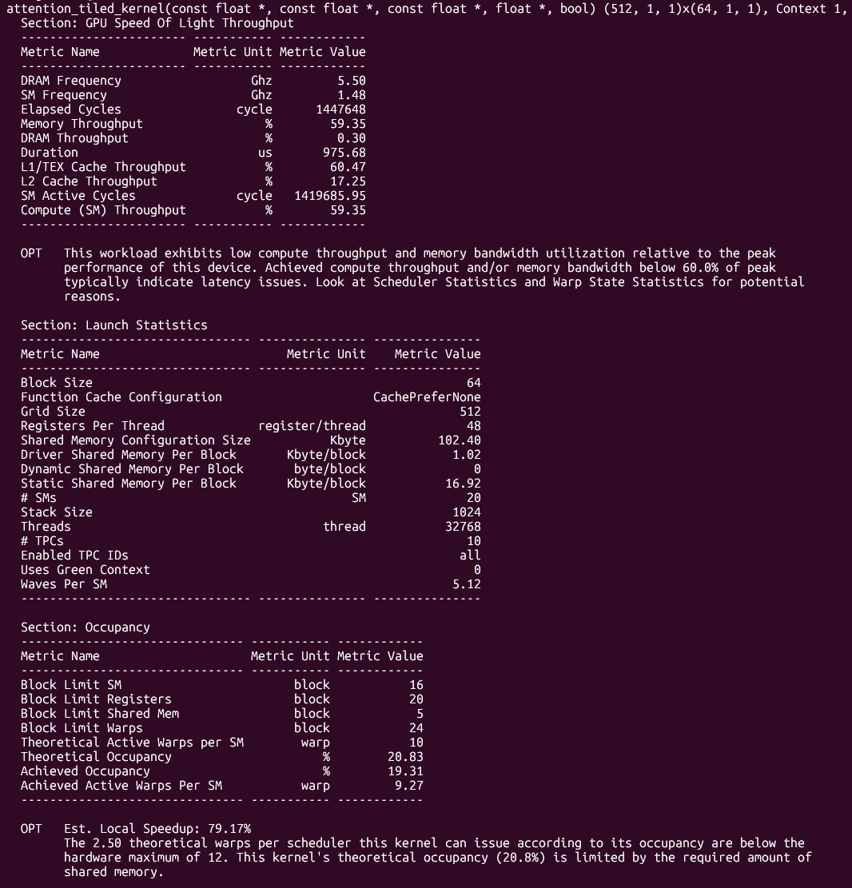
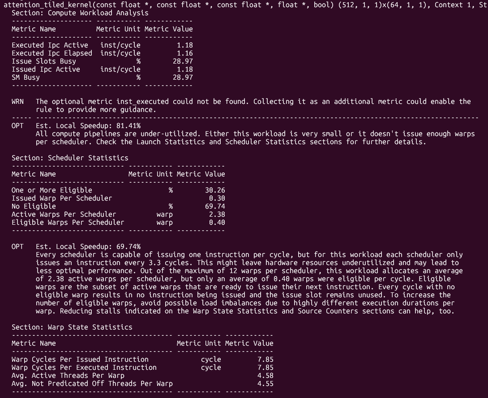
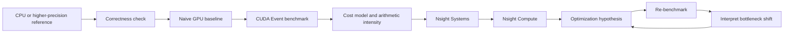

# cuda-self-learning

`cuda-self-learning` is a profiling-guided CUDA performance engineering study. It follows six workloads—from bandwidth-bound vector addition to ML-system-relevant MLP and attention kernels—through the same loop: **measure, diagnose, optimize, and re-measure**.

The goal is not simply to make kernels more complicated, but to understand why an optimization succeeds or fails on real GPU hardware.

The repository contains correctness checks, CUDA Event benchmarks, analytical cost models, Nsight evidence, negative results, and a [full technical report](PROJECT_REPORT.md). It is a learning and research project, not a production kernel library.

## Highlights

The most useful results include both speedups and regressions:

| Workload | Result | What changed |
| --- | ---: | --- |
| Parallel Reduction | **22.91×** faster in the first audit snapshot | Global atomic contention was replaced by hierarchical reduction, warp shuffle, and four-item chunking. |
| Softmax | **3.63×** faster in the first audit snapshot | One-thread-per-row execution became one-block-per-row with a joint online `(max, sum)` reduction. |
| Matrix Multiplication | **3.67×**, reaching **425.95 GFLOPS** in the first audit snapshot | Shared-memory tiling plus a 2×2 register tile increased both block- and thread-level reuse. |
| MLP | Full tiled fusion was **6.2% slower** than the naive pipeline in the first audit snapshot | Lower intermediate traffic did not compensate for barriers, resource pressure, and reduced latency hiding. |
| Attention | Tiled latency was **20.9%–38.4% higher** across four independent evidence sets | IO reduction was undermined by serialized score computation, poor lane use, low occupancy, and synchronization. |

These are workload- and run-specific measurements, not universal performance claims. Absolute latency and some speedup magnitudes varied between runs because the benchmark environment did not fully control clocks, power, or thermal state.

## Optimization Journey

| Workload | Baseline | Optimization path | Main lesson |
| --- | --- | --- | --- |
| [Vector Add](cuda/01_vector_add.cu) | One thread per element | Grid-stride → four items/thread → `float4` | Changing code structure does not help much when compulsory memory traffic is unchanged. |
| [Reduction](cuda/02_reduce_sum.cu) | Global `atomicAdd` | Shared tree → warp shuffle → chunked reduction | Contention and reduction hierarchy matter more than arithmetic count. |
| [Softmax](cuda/03_softmax.cu) | One thread per row | Online Softmax → block reduction → block-online | Reducing algorithmic passes becomes powerful only with an appropriate parallel mapping. |
| [MatMul](cuda/04_matmul.cu) | One thread per output | Shared tile → warp-oriented mapping → register blocking | Thread-level reuse is not equivalent to block-level data reuse. |
| [MLP](cuda/05_mlp.cu) | Linear → ReLU → Linear | ReLU epilogue fusion → single-kernel tiled fusion | Kernel fusion is a resource trade-off, not an automatic speedup. |
| [Attention](cuda/06_attention.cu) | QKᵀ → Softmax → PV | Tiled/fused online attention prototype | Reducing HBM traffic is insufficient if work partitioning destroys parallelism. |

The workloads deliberately progress from a simple bandwidth ceiling toward coupled questions of reuse, synchronization, scheduling, fusion, and IO-aware algorithm design.

## Selected Results

Unless noted otherwise, the table uses the **first default-NVCC audit snapshot** from the RTX 3050 Ti Laptop GPU. Ratios are calculated only within the same measurement set.

| Workload and shape | Comparison | Representative result |
| --- | --- | ---: |
| Vector Add, `N = 2²⁴` | Four implementations, stored Nsight Systems run | 1.224–1.239 ms; Naive ≈ 164.4 GB/s |
| Reduction, `N = 2²⁰ + 37` | Atomic → Chunked | 2.2562 → 0.0985 ms; **22.91×** |
| Softmax, `16384 × 257` | Naive → Block-online | 4.5854 → 1.2642 ms; **3.63×** |
| GEMM, `1024³` | Naive → Register-blocked | 18.4823 → 5.0416 ms; **3.67×**, 425.95 GFLOPS |
| MLP, `4096×128 → 4096×256 → 4096×128` | Naive / Fused / Tiled-fused | 4.6537 / 4.5963 / 4.9431 ms |
| Attention, `N = 512`, `d = 64` | Naive vs. Tiled, four evidence sets | Tiled slower in every set; 20.9%–38.4% higher latency |

A second terminal pass preserved the main ordering except for minor reordering among the closely matched Vector Add variants, but several absolute times changed substantially. The measurements should therefore be read as evidence for bottleneck behavior and relative ordering under specific runs—not as publication-quality reproducibility. See [PROJECT_REPORT.md](PROJECT_REPORT.md) for both measurement sets, provenance, formulas, and caveats.

## Profiling-Guided Case Studies

### Reduction — removing contention

The atomic baseline sends every thread to the same global accumulator. The optimized path first aggregates within a block, then replaces most shared-memory tree steps with warp shuffles, and finally lets each thread accumulate four input elements before reduction. This reduces the first-stage partial count from 4,097 to 1,025.


*The selected first-stage Chunked launch took 31.94 µs and reached 87.63% DRAM throughput. It is one stage of the 0.0985 ms multi-launch reduction, not the end-to-end measurement.*

The result is a bottleneck shift: after global contention and most hierarchy overhead are removed, the first stage approaches a DRAM-dominated regime.

### Softmax — active warps are not necessarily eligible warps

The Naive kernel assigns one row to one thread. Adjacent lanes therefore access elements separated by 257 floats, and a grid of only 64 blocks provides little latency-hiding capacity. The profile reports 95.63% `No Eligible` cycles and only 3.89% issue-slot utilization.

The Block-online kernel assigns one block to a row and reduces a joint online `(max, sum)` state. Coalescing and row-level parallelism improve; issue-slot utilization rises to 76.33%, while synchronization becomes the main remaining concern.

| Naive: scheduler starvation | Block-online: improved warp supply |
| --- | --- |
|  |  |

This is a useful example of **bottleneck transfer**: fixing memory access and work mapping exposes reduction barriers and synchronization cost.

### GEMM — why register blocking worked

The 16×16 shared-tiled kernel creates block-level reuse. The 8×64 warp-oriented mapping gives each thread two outputs, but its geometry does not increase block-level reuse, so it remains close to ordinary shared tiling. The 2×2 register-blocked kernel instead uses a 32×32 output tile and reuses loaded fragments across four FMAs.


*Register blocking reached 425.95 GFLOPS in the first audit snapshot. Profiling then pointed to an on-chip bottleneck: LSU utilization was about 90.2%, with MIO throttle accounting for about 40.37% of average warp stall cycles.*

The next optimization target is therefore shared-memory layout, bank-conflict behavior, and output-store organization—not a generic attempt to reduce DRAM traffic.

### Attention — why lower memory traffic was still slower

The current **FlashAttention-inspired tiled/fused attention prototype** processes K/V in 32-token tiles, maintains online max/sum normalization, and avoids materializing the full `N × N` score and probability matrices.

It is not complete FlashAttention. Each block handles only one query row, and thread 0 serially computes every score in a tile while the other threads wait. K/V tiles are not reused across query rows.

| Resource and occupancy evidence | Scheduler and lane-utilization evidence |
| --- | --- |
|  |  |

The profiled kernel achieved only 19.31% occupancy, averaged 4.55 useful lanes per warp, and spent 69.74% of cycles with no eligible warp. All four preserved benchmark sets keep the same ordering:

| Evidence set | Naive | Tiled | Tiled/Naive performance |
| --- | ---: | ---: | ---: |
| Project log | 0.734201 ms | 0.921953 ms | 0.796× |
| Separate screenshot run | 0.772908 ms | 0.934487 ms | 0.827× |
| First audit snapshot | 2.84417 ms | 3.93592 ms | 0.723× |
| Second terminal verification | 0.724436 ms | 0.921642 ms | 0.786× |

The absolute times must not be mixed across rows. The stable lesson is architectural: **IO reduction must be co-designed with parallel work partitioning.**

## Performance Engineering Workflow



CUDA Events establish latency. Nsight Systems checks launch and transfer boundaries. Nsight Compute is then used to test specific hypotheses about memory throughput, occupancy, eligible warps, lane utilization, instruction pipelines, and stalls. Analytical traffic and arithmetic-intensity estimates remain explicitly separate from measured hardware counters.

## Repository Structure

```text
.
├── cuda/
│   ├── 01_vector_add.cu
│   ├── 02_reduce_sum.cu
│   ├── 03_softmax.cu
│   ├── 04_matmul.cu
│   ├── 05_mlp.cu
│   ├── 06_attention.cu
│   └── cuda_utils.cuh
├── images/                 # Nsight Systems / Nsight Compute evidence
├── PROJECT_REPORT.md       # complete methodology, evidence, and fact check
├── 项目日志.md              # experiment and profiling notes
└── README.md
```

Generated binaries and profiler database artifacts are intentionally omitted from this overview.

## Build and Run

### Prerequisites

- An NVIDIA CUDA-capable GPU
- NVIDIA driver and CUDA Toolkit with `nvcc`
- A Linux or WSL shell for the commands below

The audited environment used an RTX 3050 Ti Laptop GPU (compute capability 8.6), CUDA 13.3, and WSL2. The repository currently has no Makefile or CMake build.

Build and run one workload from the repository root:

```bash
nvidia-smi
nvcc --version

nvcc cuda/01_vector_add.cu -o vector_add
./vector_add
```

To build all six programs with the same default-NVCC style used by the audit:

```bash
mkdir -p build

for src in \
  cuda/01_vector_add.cu \
  cuda/02_reduce_sum.cu \
  cuda/03_softmax.cu \
  cuda/04_matmul.cu \
  cuda/05_mlp.cu \
  cuda/06_attention.cu
do
  name="$(basename "$src" .cu)"
  nvcc "$src" -o "build/$name"
done

./build/01_vector_add
./build/06_attention
```

Each program runs built-in correctness checks and then reports its benchmark variants. Compiler optimization flags and architecture targets are not standardized yet; record them when comparing new results with the report.

## What I Learned

1. **Arithmetic intensity bounds optimization headroom.** Vector Add cannot escape compulsory input/output traffic through indexing changes alone.
2. **Occupancy is not a performance objective by itself.** Resident warps are useful only when dependencies and resources leave them eligible to issue.
3. **Memory optimization often moves the bottleneck.** Softmax shifts from memory-latency starvation toward synchronization after its mapping is fixed.
4. **Shared memory helps only when it creates useful reuse.** Otherwise, its instructions, barriers, and residency cost can dominate.
5. **More work per thread is a trade-off.** It may reduce hierarchy overhead or improve register reuse, but it can also reduce parallelism and increase register lifetime.
6. **Fusion must preserve latency hiding.** Removing an intermediate tensor did not rescue the fully fused MLP or serialized Attention mapping.
7. **Negative results are profiling evidence.** Warp-tiled GEMM, full MLP fusion, and tiled Attention were more informative after their regressions were explained rather than hidden.

## Current Limitations

- Measurements come from one RTX 3050 Ti Laptop GPU and mostly fixed shapes.
- Clock, power, temperature, and run ordering were not controlled rigorously enough for publication-quality reproducibility.
- Benchmarks report means but not a complete statistical distribution.
- Matched cuBLAS, CUTLASS, PyTorch, Triton, and official FlashAttention baselines are not implemented.
- Kernels are FP32 only; there is no Tensor Core path.
- The Attention kernel is an intermediate prototype, not complete FlashAttention.
- Most Nsight Compute evidence is preserved as screenshots rather than replayable reports.

The [technical report](PROJECT_REPORT.md) documents additional correctness, portability, profiling, and experimental limitations.

## Roadmap

1. **Reproducible benchmark harness**
   - Record device/compiler metadata and run order.
   - Add more trials, median, standard deviation, p95, and CSV output.
   - Randomize version order and sweep shapes, blocks, and tiles.
2. **Matched baselines**
   - Add cuBLAS/CUTLASS for GEMM and PyTorch/Triton references for ML operators.
3. **GEMM and MLP dataflow**
   - Improve shared-memory layout and store coalescing.
   - Sweep register tiles, add double buffering, and investigate FP16/BF16 Tensor Cores.
   - Tile and reuse MLP weights instead of only eliminating the hidden tensor.
4. **Path toward FlashAttention**
   - Remove thread-0 score serialization.
   - Use `Br > 1`, warp/block-cooperative QK, parallel online reduction, and cross-query K/V reuse.
   - Reduce block-wide synchronization before exploring asynchronous pipelines.
5. **Profiler infrastructure**
   - Preserve complete Nsight Compute reports and commands.
   - Measure actual memory traffic and calibrated compute/memory ceilings before constructing a formal Roofline analysis.

## Detailed Report

For the complete experimental methodology, benchmark provenance, Nsight analysis, analytical models, limitations, and fact-check notes, see **[PROJECT_REPORT.md](PROJECT_REPORT.md)**.
