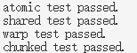
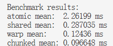
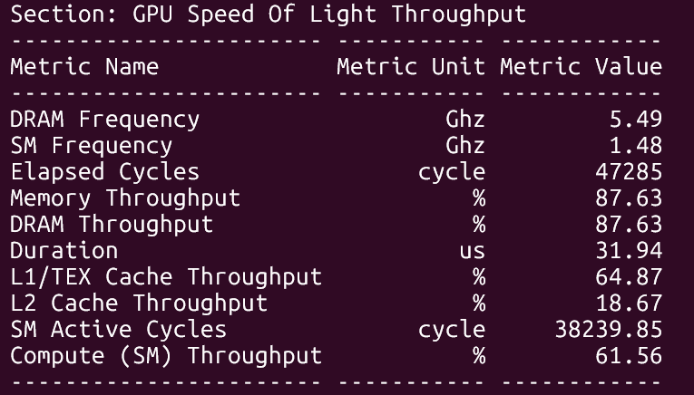

# CUDA 项目日志

## 2026.8.26

### 完成内容

实现了 `01_vector_add.cu`。

具体实现了：

- `vector_add_cpu_baseline`
- `vector_add_naive_kernel`
- `vector_add_grid_stride_kernel`
- `vector_add_vectorized_kernel`
- `vector_add_tiled_kernel`

### Correctness

实现了 correctness 检查，所有 kernel 均通过测试。

### 运行结果


## 2026.8.27

### 完成内容

完整实现了 `01_vector_add.cu`，并完成了以下流程：

```text
correctness → benchmarking → profiling
```

### Benchmark


### Profiling

#### Nsight Systems 统计结果


#### Nsight Systems 时间线


### 性能分析

对于每个输出元素 `c[i] = a[i] + b[i]`：

- 读取 `a[i]`：4 bytes
- 读取 `b[i]`：4 bytes
- 写入 `c[i]`：4 bytes
- 浮点加法：1 FLOP

因此，每个元素的总访存量为 12 bytes，总计算量为 1 FLOP：

```text
Arithmetic Intensity
= 1 FLOP / 12 bytes
≈ 0.083 FLOP/byte
```

本次测试规模为：

```cpp
count = 1 << 24;
```

即：

```text
N = 16,777,216
```

总显存流量约为：

```text
16,777,216 × 12 bytes
= 201,326,592 bytes
≈ 201 MB
```

当 kernel 执行时间约为 `1.22 ms` 时：

```text
Effective Bandwidth
= 201,326,592 bytes / 0.00122 s
≈ 165 GB/s
```

对应的计算吞吐约为：

```text
16,777,216 FLOP / 0.00122 s
≈ 13.75 GFLOPS
```

### 结论

Vector Add 的算术强度很低，绝大部分工作是读取和写入 global memory。不同 kernel 版本没有减少主要的显存流量，因此性能差异很小。该算子主要受显存带宽限制，属于 **memory-bound** kernel。


## 2026.8.28

### 完成内容

实现了 `02_reduce_sum.cu` 中四个 kernel ，并编写了 correctness 检查。

### Correctness

运行结果如下：



四个 kernel 均通过 correctness 测试。

## 2026.8.29

### 完成内容

完整实现了 `02_reduce_sum.cu`，并完成了 benchmark 部分。

### Benchmark



本次测试规模为：

```cpp
N = (1 << 20) + 37;
```

即：

```text
N = 1,048,613
```

性能顺序为：

```text
Atomic < Shared < Warp < Chunked
```

### 性能分析

#### Atomic

- 大量 thread 争抢同一个地址。
- Atomic 更新高度串行化。
- 主要瓶颈是 contention 和 serialization。

#### Shared

Block 内部的树形 reduction 有 8 轮，每轮包含：

- 读取 `shared[tid]`
- 读取 `shared[tid + offset]`
- 写回 `shared[tid]`
- 执行 `__syncthreads()`

随着 `offset` 减小，越来越多线程空闲。主要额外成本包括：

- Shared memory load/store
- 多次 block synchronization
- Inactive threads

#### Warp

- 使用寄存器通信减少同步。
- 不减少输入量与运算量。
- 主要减少 shared memory traffic 和 block-wide synchronization。

#### Chunked

- 一个 thread 处理多个元素。
- 不减少输入量与运算量。
- 主要减少 block 数、partial sums 和 block-level reduction。
- 提高每个 thread 的工作量，并减少 block-level 协作成本。

每个 thread 处理的元素并不是越多越好。处理过多可能增加 register pressure，并降低 occupancy。

### Arithmetic Intensity

读取 `N` 个 `float`：

```text
约 4N bytes
```

执行 `N - 1` 次加法：

```text
约 N FLOPs
```

因此算术强度约为：

```text
Arithmetic Intensity
= N FLOPs / 4N bytes
≈ 0.25 FLOP/byte
```

优化后的 reduction 逐渐接近 **memory-bandwidth-bound**。

### 性能指标


### Nsight Compute




