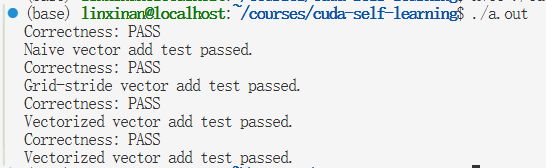

# CUDA 项目日志

## 2026.8.26

### 完成内容

实现了 `01_vector_add.cu`。

具体实现了：

- `vector_add_cpu_baseline`
- `vector_add_naive_kernel`
- `vector_add_grid_stride_kernel`
- `vector_add_vectorized_kernel`
- `vector_add_tiled_kernel`

### Correctness

实现了 correctness 检查，所有 kernel 均通过测试。

### 运行结果

