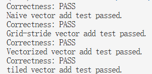
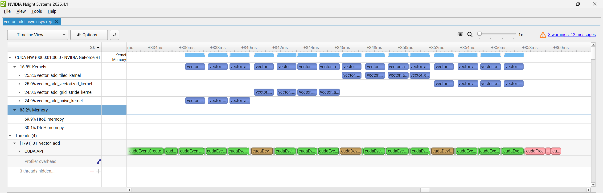

# CUDA 项目日志

## 2026.8.26

### 完成内容

实现了 `01_vector_add.cu`。

具体实现了：

- `vector_add_cpu_baseline`
- `vector_add_naive_kernel`
- `vector_add_grid_stride_kernel`
- `vector_add_vectorized_kernel`
- `vector_add_tiled_kernel`

### Correctness

实现了 correctness 检查，所有 kernel 均通过测试。

### 运行结果




## 2026.8.27

### 完成内容

完整实现了 `01_vector_add.cu`，并完成了以下流程：

```text
correctness → benchmarking → profiling
```

### Benchmark


### Profiling

#### Nsight Systems 统计结果


#### Nsight Systems 时间线



### 性能分析

对于每个输出元素 `c[i] = a[i] + b[i]`：

- 读取 `a[i]`：4 bytes
- 读取 `b[i]`：4 bytes
- 写入 `c[i]`：4 bytes
- 浮点加法：1 FLOP

因此，每个元素的总访存量为 12 bytes，总计算量为 1 FLOP：

```text
Arithmetic Intensity
= 1 FLOP / 12 bytes
≈ 0.083 FLOP/byte
```

本次测试规模为：

```cpp
count = 1 << 24;
```

即：

```text
N = 16,777,216
```

总显存流量约为：

```text
16,777,216 × 12 bytes
= 201,326,592 bytes
≈ 201 MB
```

当 kernel 执行时间约为 `1.22 ms` 时：

```text
Effective Bandwidth
= 201,326,592 bytes / 0.00122 s
≈ 165 GB/s
```

对应的计算吞吐约为：

```text
16,777,216 FLOP / 0.00122 s
≈ 13.75 GFLOPS
```

### 结论

Vector Add 的算术强度很低，绝大部分工作是读取和写入 global memory。不同 kernel 版本没有减少主要的显存流量，因此性能差异很小。该算子主要受显存带宽限制，属于 **memory-bound** kernel。
