# CUDA 项目日志

## 日期索引

- [2026.8.26](#log-2026-08-26)
- [2026.8.27](#log-2026-08-27)
- [2026.8.28](#log-2026-08-28)
- [2026.8.29](#log-2026-08-29)
- [2026.8.30](#log-2026-08-30)
- [2026.8.31](#log-2026-08-31)

<a id="log-2026-08-26"></a>

## 2026.8.26

### 完成内容

实现了 `01_vector_add.cu`。

具体实现了：

- `vector_add_cpu_baseline`
- `vector_add_naive_kernel`
- `vector_add_grid_stride_kernel`
- `vector_add_vectorized_kernel`
- `vector_add_tiled_kernel`

### Correctness

实现了 correctness 检查，所有 kernel 均通过测试。

### 运行结果


<a id="log-2026-08-27"></a>

## 2026.8.27

### 完成内容

完整实现了 `01_vector_add.cu`，并完成了以下流程：

```text
correctness → benchmarking → profiling
```

### Benchmark

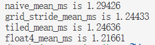

### Profiling

#### Nsight Systems 统计结果

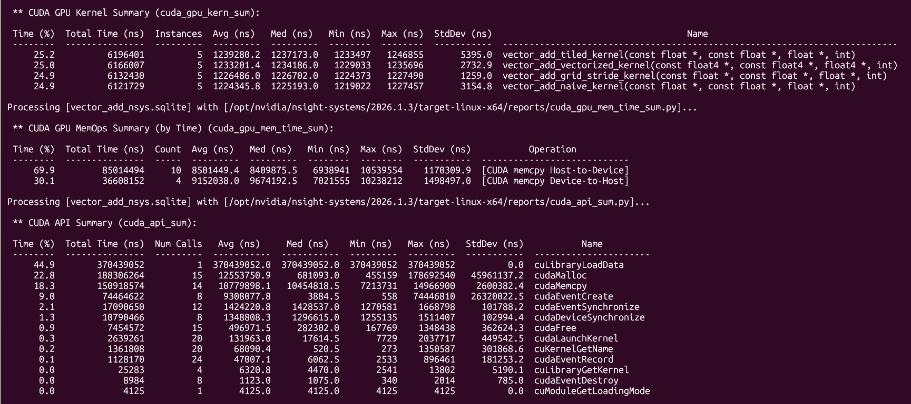

#### Nsight Systems 时间线


### 性能分析

对于每个输出元素 `c[i] = a[i] + b[i]`：

- 读取 `a[i]`：4 bytes
- 读取 `b[i]`：4 bytes
- 写入 `c[i]`：4 bytes
- 浮点加法：1 FLOP

因此，每个元素的总访存量为 12 bytes，总计算量为 1 FLOP：

```text
Arithmetic Intensity
= 1 FLOP / 12 bytes
≈ 0.083 FLOP/byte
```

本次测试规模为：

```cpp
count = 1 << 24;
```

即：

```text
N = 16,777,216
```

总显存流量约为：

```text
16,777,216 × 12 bytes
= 201,326,592 bytes
≈ 201 MB
```

当 kernel 执行时间约为 `1.22 ms` 时：

```text
Effective Bandwidth
= 201,326,592 bytes / 0.00122 s
≈ 165 GB/s
```

对应的计算吞吐约为：

```text
16,777,216 FLOP / 0.00122 s
≈ 13.75 GFLOPS
```

### 结论

Vector Add 的算术强度很低，绝大部分工作是读取和写入 global memory。不同 kernel 版本没有减少主要的显存流量，因此性能差异很小。该算子主要受显存带宽限制，属于 **memory-bound** kernel。


<a id="log-2026-08-28"></a>

## 2026.8.28

### 完成内容

实现了 `02_reduce_sum.cu` 中四个 kernel ，并编写了 correctness 检查。

### Correctness

运行结果如下：


四个 kernel 均通过 correctness 测试。

<a id="log-2026-08-29"></a>

## 2026.8.29

### 完成内容

完整实现了 `02_reduce_sum.cu`，并完成了 benchmark 部分。

### Benchmark


本次测试规模为：

```cpp
N = (1 << 20) + 37;
```

即：

```text
N = 1,048,613
```

性能顺序为：

```text
Atomic < Shared < Warp < Chunked
```

### 性能分析

#### Atomic

- 大量 thread 争抢同一个地址。
- Atomic 更新高度串行化。
- 主要瓶颈是 contention 和 serialization。

#### Shared

Block 内部的树形 reduction 有 8 轮，每轮包含：

- 读取 `shared[tid]`
- 读取 `shared[tid + offset]`
- 写回 `shared[tid]`
- 执行 `__syncthreads()`

随着 `offset` 减小，越来越多线程空闲。主要额外成本包括：

- Shared memory load/store
- 多次 block synchronization
- Inactive threads

#### Warp

- 使用寄存器通信减少同步。
- 不减少输入量与运算量。
- 主要减少 shared memory traffic 和 block-wide synchronization。

#### Chunked

- 一个 thread 处理多个元素。
- 不减少输入量与运算量。
- 主要减少 block 数、partial sums 和 block-level reduction。
- 提高每个 thread 的工作量，并减少 block-level 协作成本。

每个 thread 处理的元素并不是越多越好。处理过多可能增加 register pressure，并降低 occupancy。

### Arithmetic Intensity

读取 `N` 个 `float`：

```text
约 4N bytes
```

执行 `N - 1` 次加法：

```text
约 N FLOPs
```

因此算术强度约为：

```text
Arithmetic Intensity
= N FLOPs / 4N bytes
≈ 0.25 FLOP/byte
```

优化后的 reduction 逐渐接近 **memory-bandwidth-bound**。

### 性能指标

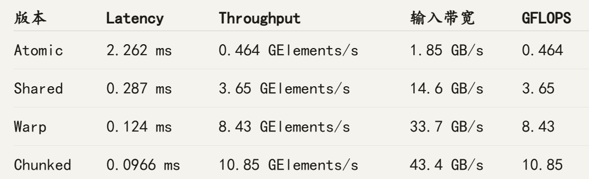

### Nsight Compute


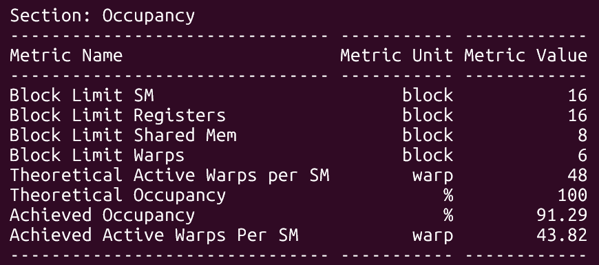

<a id="log-2026-08-30"></a>

## 2026.8.30

### 完成内容

完整实现了 `03_softmax.cu`，完成了以下流程：

```text
kernel → correctness → benchmark → profile
```

具体实现了：

- `naive_softmax`
- `online_softmax`
- `masked_softmax`
- `causal_softmax`
- `block_softmax`
- `block-online softmax`

### Correctness & Benchmark

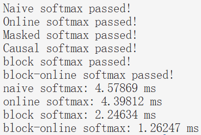

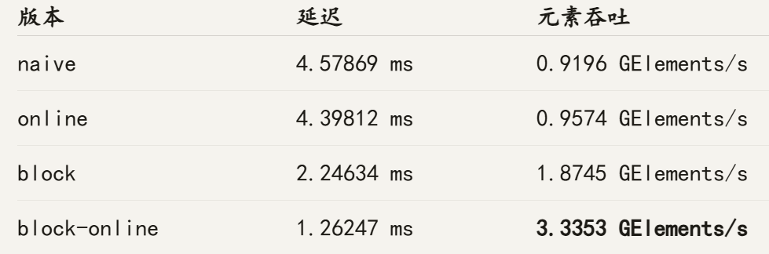

### Naive Softmax 性能分析

#### Nsight Compute 结果

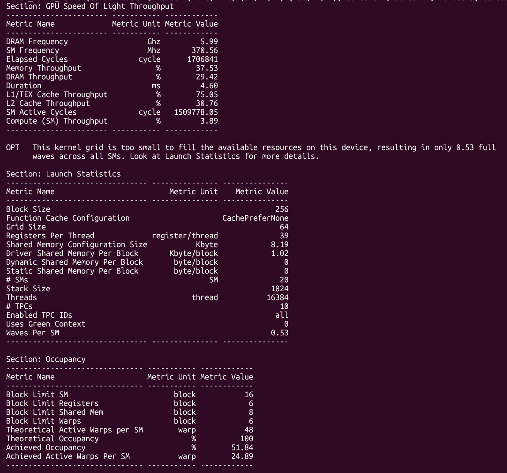

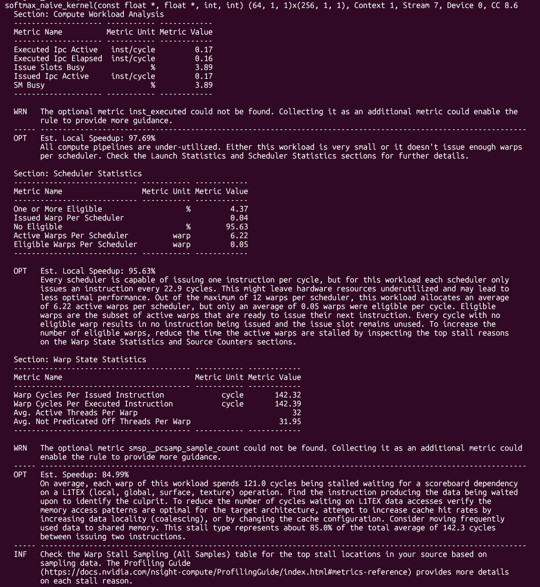

#### 结论

Naive softmax 是典型的 **memory-latency-bound**。约 85% 的 warp 等待来自 L1TEX/global-memory 数据依赖；grid 太小、active warp 数不足，又使 GPU 无法有效隐藏这些延迟。

Naive softmax 因“一线程一行”的 mapping 产生跨行、不合并的 warp memory access，同时只有 64 个 block，无法提供足够 warp 隐藏访问延迟，最终使 scheduler 在 95.63% 的周期中找不到 eligible warp。

#### Naive 与 Online 的比较

Online softmax 通过维护可动态重标定的 `(max, sum)` 状态，把求 max 和求 sum 合并到同一次输入遍历中，因此从三次扫描降到两次。在 naive GPU mapping 中，输入访问不合并，而且 profile 显示主要瓶颈是 L1TEX memory dependency，所以少一次扫描带来了约 4% 加速。但 online 增加了指数运算和串行依赖，因此这个加速不是普遍保证，取决于精度、输入尺寸和硬件。

### Block-online Softmax 性能分析

#### Nsight Compute 结果

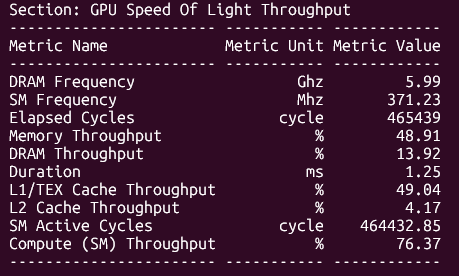

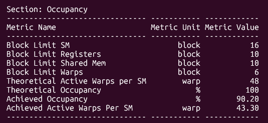

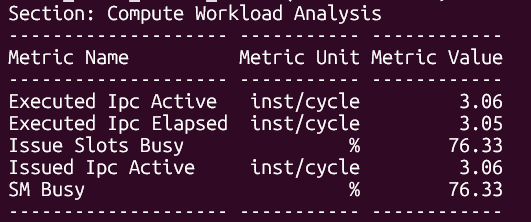

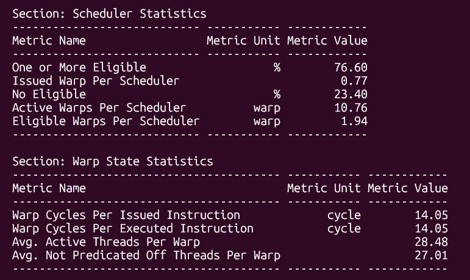

#### 优点

- Block mapping 改善了行内并行性和 global memory coalescing。
- Block-online 减少了一次输入遍历，并把两轮 reduction 合并成了一轮。
- 输入遍历从 3 次降为 2 次，block reduction 从 2 轮降为 1 轮。

#### 瓶颈

- Kernel 的压力主要位于计算/控制侧，而不是 off-chip memory；具体损失来自同步等待。Active warp 因为同步或依赖而无法执行。
- 最大瓶颈是 block barrier，属于 **block-level barrier synchronization-bound**。

#### 结论

在 `16384 × 257`、`256 threads/block`、RTX 3050 Ti 上，block-online softmax 是当前最快版本，比 naive 快约 3.63 倍。主要的性能损失来自 shared-memory tree reduction 中频繁的 block barrier。


<a id="log-2026-08-31"></a>

## 2026.8.31

### MATMUL 部分

### 完成内容

完整实现了 `04_matmul.cu`，包括：

- `matmul_naive_kernel`
- `matmul_tiled_kernel`
- `matmul_warp_tiled_kernel`
- `matmul_register_blocked_kernel`

### 优化路线

```text
一线程一输出
→ shared-memory tiling
→ warp 分工与 1×2 register tile
→ 2×2 register blocking
```

### Arithmetic Intensity

矩阵乘法算术强度为：

\[
\frac{BN \times BM}{2 \times (BN + BM)}
\]

其中，`BN`、`BM` 为输出 tile 的列数和行数。

### Correctness

以下测试全部通过：

- 规则尺寸：`64 × 64 × 64`
- 非整齐尺寸：`67 × 70 × 19`

### Benchmark

本次 benchmark 的矩阵规模为：

```text
M = N = K = 1024
```

矩阵乘法的有效计算量为：

\[
2MNK = 2 \times 1024^3 \approx 2.147 \times 10^9\ \text{FLOPs}
\]

| Kernel | 平均时间 | 有效吞吐量 | 相对 naive 加速 |
| --- | ---: | ---: | ---: |
| Naive | 18.48 ms | 116.2 GFLOPS | 1.00× |
| Shared tiled | 13.92 ms | 154.2 GFLOPS | 1.33× |
| Warp-tiled | 13.95 ms | 154.0 GFLOPS | 1.33× |
| Register-blocked | 5.04 ms | 426.1 GFLOPS | 3.67× |

### Naive Profile

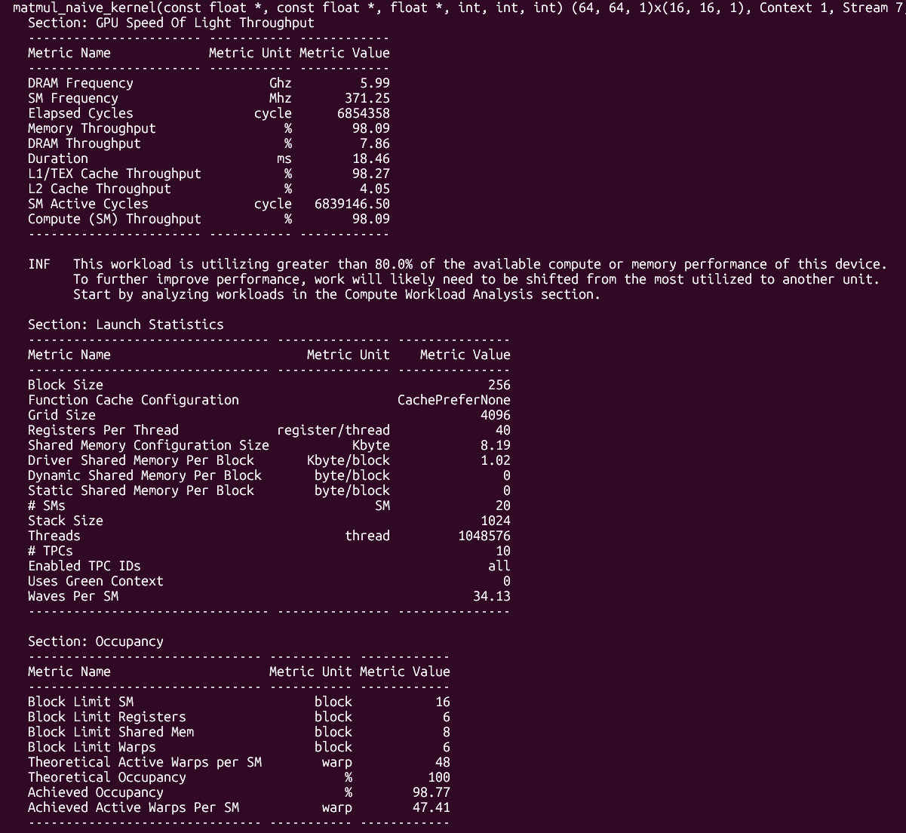

#### 结论

Occupancy 接近 99%，DRAM throughput 只有约 8%，但 L1/TEX throughput 接近饱和，说明 GPU 花费大量片上资源处理重复数据加载和相关指令，有效 FMA 吞吐较低。

### Warp-tiled 与 Shared tiled 对比

Warp-tiled 虽然让每个线程计算两个输出，但其 block tile 为 8×64。B tile 中每个元素只能被 8 个输出行复用，使理论算术强度约为 3.56 FLOP/byte，低于普通 16×16 tiled 的 4 FLOP/byte。因此，每线程计算更多输出不等于整个 block 的数据复用率更高，最终 warp-tiled 与普通 tiled 性能基本相同。

### Register Profile

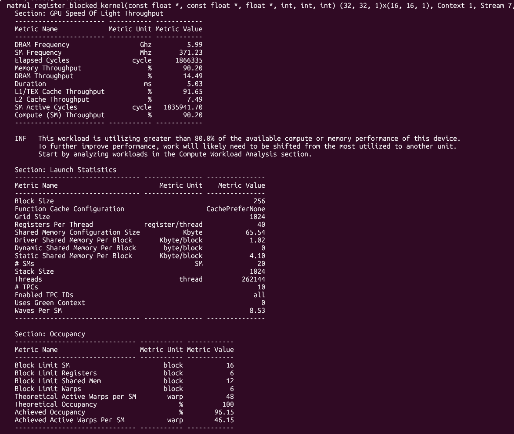
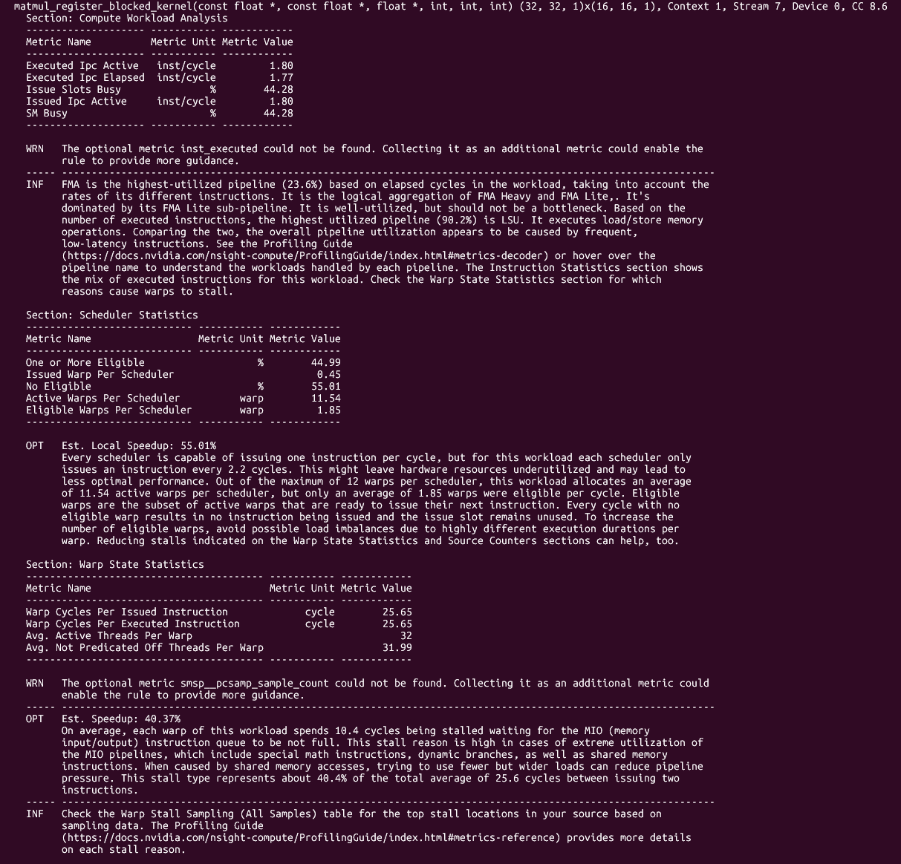

#### 瓶颈

Register-blocked 当前主要受 shared-memory/MIO 指令通路压力限制。访存指令组织不够高效，使 LSU/MIO 通路承担了额外的 wavefront 和 memory transaction。频繁的 shared-memory 指令和 shared bank conflict 是 MIO throttle stall 的主要已知贡献因素；低效 global store 则使每个 32-byte sector 只有 16 bytes 有效，额外增加了 L1TEX/LSU memory transaction。两者都属于片上访存效率问题。

#### 结论

Register-blocked 通过 shared-memory tiling 和 2×2 register tiling，提高了 A/B 数据复用率和算术强度，因此比 naive 快约 3.67 倍。不过，它目前仍未充分利用 FMA 流水线。性能主要受频繁的 shared-memory 指令、shared store bank conflict 和低效 global store 影响，这些问题使 LSU/MIO 通路接近饱和，并造成约 40.37% 的 MIO throttle stall。下一阶段的优化重点应从 global-memory reuse 转向片上访存效率，包括改善 B tile 的 cooperative loading、减少 bank conflict，以及合并相邻 C 输出的 store。

### 备注

1. Bank conflict 是一个 warp 中多个线程访问 shared memory 的同一个 bank、但访问不同地址，导致一次 warp 访问被拆成多个 wavefront 串行完成。

### MLP 部分

#### 完成内容

完整实现了 `05_mlp.cu`，包括：

- `mlp_naive_linear1_kernel`
- `relu_kernel`
- `mlp_naive_linear2_kernel`
- `mlp_fused_linear1_relu_kernel`
- `mlp_tiled_fused_kernel`

#### Correctness

Naive、Fused 和 Tiled-fused 三个版本均通过 correctness 测试。

#### Benchmark

本次 benchmark 的参数为：

```text
Batch = 4096
InputDim = 128
HiddenDim = 256
OutputDim = 128
ThreadsPerBlock = 256
TiledThreadsPerBlock = 256
InputTile = 32
Warmups = 20
Trials = 200
```

| Kernel | 平均时间 | 有效吞吐量 | 相对 Naive 加速 |
| --- | ---: | ---: | ---: |
| Naive | 4.653 ms | 115.4 GFLOPS | 1.000× |
| Fused | 4.593 ms | 116.9 GFLOPS | 1.013× |
| Tiled-fused | 4.941 ms | 108.7 GFLOPS | 0.942× |

矩阵乘法部分的有效计算量为：

```text
2 × Batch × (InputDim × HiddenDim + HiddenDim × OutputDim)
= 536,870,912 FLOPs
≈ 0.537 GFLOP
```

Fused 比 Naive 快约 1.3%；Tiled-fused 比 Fused 慢约 7.6%，比 Naive 慢约 6.2%。

#### Profile

##### Profile 证据

| Kernel | Duration | Registers/Thread | Achieved Occupancy | Eligible Warps/Scheduler | Issue Slots Busy | 主要 Stall |
| --- | ---: | ---: | ---: | ---: | ---: | --- |
| Fused Linear1 + ReLU | 2.30 ms | 40 | 96.51% | 1.55 | 24.40% | LG throttle：72.7% |
| Fused Linear2 | 2.28 ms | 39 | 96.95% | 1.57 | 23.27% | LG throttle：71.8% |
| Tiled-fused | 4.97 ms | 44 | 74.26% | 0.27 | 14.42% | L1TEX dependency：53.69% |

两个 Fused kernel 的时间之和约为 4.58 ms，与 CUDA Event 测得的 4.59 ms 基本一致。

##### Tiled-fused 瓶颈

L1TEX/cache load dependency latency。

##### 与 Fused 对比

虽然减少了 hidden 的 global-memory 往返和一次 kernel launch，但寄存器增加、occupancy 降低、同步增多，并且第二阶段只有一半线程工作，使 eligible warp 降至 0.27，无法有效隐藏权重加载延迟。因此 tiled-fused 比 fused 慢约 8%，说明在当前实现中，过度融合的调度与片上访存成本超过了减少中间 global-memory 流量的收益。

#### 结论

该 kernel 主要受片上 cache/load latency 和数据依赖限制，而不是显存带宽或计算吞吐限制。将 x 和 hidden 放进 shared memory，并没有解决占主要访问量的 w1、w2 权重加载问题。

Kernel fusion 不是越多越好。融合减少 global-memory traffic，但也可能增加寄存器压力、同步、阶段性线程闲置，并降低 latency hiding。

#### Arithmetic Intensity

忽略 bias 和 ReLU 的少量运算，三个版本的主要计算量相同：

```text
FLOPs
= 2 × Batch × (InputDim × HiddenDim + HiddenDim × OutputDim)
= 536,870,912 FLOPs
```

按照理想的最小 DRAM 流量估算，必须访问的 `x`、`w1`、`w2` 和 `y` 共约 4.25 MiB。一个完整的 hidden tensor 大小为：

```text
Batch × HiddenDim × sizeof(float)
= 4096 × 256 × 4 bytes
= 4 MiB
```

| Kernel | Hidden 的 Global-memory 流量 | 理想总 DRAM 流量 | 理论算术强度 |
| --- | ---: | ---: | ---: |
| Naive | 约 16 MiB（4 次访问） | 约 20.25 MiB | 约 25.3 FLOP/byte |
| Fused | 约 8 MiB（2 次访问） | 约 12.25 MiB | 约 41.8 FLOP/byte |
| Tiled-fused | 0 MiB | 约 4.25 MiB | 约 120.5 FLOP/byte |

这些数值是按照理想最小 DRAM 流量计算的理论算术强度，只能说明融合减少了中间 hidden 的显存访问，不能代表当前实现实际发生的 L1/L2 load 数量。Profile 表明当前瓶颈位于 L1TEX/cache load dependency，因此理论算术强度最高的 Tiled-fused 并不一定最快。

